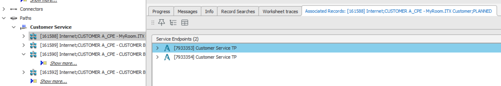
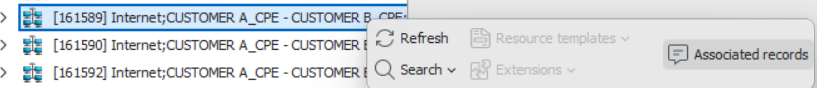
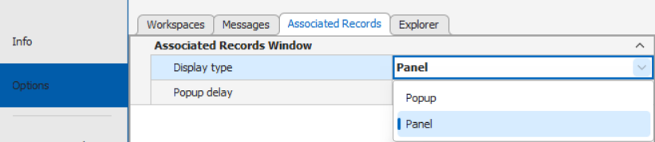

# Associated Records

The **Associated Records window** provides quick, contextual access to related records within **Aktavara Console**. These are particularly useful for creating associations between 'virtualized' and 'software defined'  functions that may be defined as node types but physically reside on different equipment. Associated Records can easily present these physical and logical hierarchies and relationships. 

**Associated Records** can be presented in two different modes:

* **Panel** - where a a permanent window is docked in the lower section next to **messages**, information and **progress** windows. If the window is not active, users can select the Associated Records menu item from the mini tool bar on a selected record.

* **Popup** via the **Mini toolbar**- where a popup containing the associated records will appear when the user selects the **Associated records** option in the Mini Toolbar. 
  
  
  
  * If Associated Records are linked to the selected record, the Mini Toolbar will contain an Associated Records menu item. 
  * Selecting it will open a popup window that closes automatically when you click anywhere other than the popup window. 
  
  Depending on configuration, the window may include **collapsible group boxes** containing categorized record sets.

---

## Using the Associated Records Window

### 1. View Associated Records

- Locate a record in any workspace (e.g., Explorer, Spreadsheet, or graphical view).  
- Click or Hover your mouse over it to open the **Associated Records window**.

### 2. Move or Pin the Window

- Move your mouse pointer inside the window to activate its frame.  
- Drag to reposition or dock it as a panel.  
- **Pin** the window (right-click → *Pin* or press **ALT + P**) to keep it open while moving the mouse elsewhere.
  
  
  
  ✅ **Tip:** Pin and reposition the window for multitasking across workspaces without losing visibility of associated data.

### 3. Add Records (Editable Windows Only)

- If editable (configured in Aktavara Designer), pin the window.  
- Drag and drop additional records from other workspaces into it.

### 4. Remove Associated Records

- Right-click a record (or select multiple using **CTRL + Click**) → **Remove**.  
- Confirm by selecting **Yes** in the prompt.

### 5. Use Context Menu Options

The right-click menu within the Associated Records window provides several actions:

- **Show All in Explorer**
- **Show All in Spreadsheet**
- **Open**
- Plus all context menu operations available for individual records.

---

## Configuring User Preferences

You can personalize how the Associated Records window behaves.

1. Open **Tools → Options**.  
2. Select the **Associated Records** tab.  
3. Adjust the following settings:
   - **Display Type:** Choose between *Panel* or *Popup* view.  
   - **Popup Delay:** Set how long (in seconds) to wait before showing the window after hovering.

> 💡 Avoid extremely short delays (unintentional pop-ups) or very long ones (unnecessary waiting).

