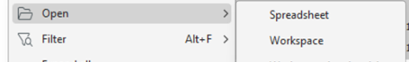
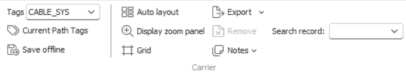

# Carrier Workspace

The **Carrier Workspace** is a graphical editor used to view, design, and modify **carrier records**. It provides a visual representation of node entities as boxes connected by lines that represent **carrier segments** or other **carrier records**. This workspace enables engineers to understand and manage carrier relationships, contained carriers, and connectivity efficiently.

Contained carriers are displayed according to type settings (generic or specific) and show their **description formats** and **tag allocations** — similar to how these are displayed in Topology and Path workspaces. When a **sectional schematic** is configured, the Aktavara Console displays it automatically in the relevant workspace.

---

## Starting the Carrier Workspace

To start the Carrier Workspace:

1. Launch **Aktavara Console**.  
2. In the **Explorer Workspace**, expand **Carriers** and locate the carrier type you want to view or modify.  
3. Double-click the desired carrier record to open it.  

The **Carrier Workspace** opens, displaying the carrier diagram and associated relationships.

---

## Adding and Removing Content

Users can add or remove **notes**, **nodes**, and **contained carriers** directly within the graphical workspace.

### Adding and Managing Notes

- **Add a Note:** Right-click on an empty area and select **Notes > Add Note**. A note box will appear. Double-click to edit its text and click **Save** on the toolbar to confirm.  
- **Hide/Show Notes:** Right-click an empty area and select **Notes > Show All Notes** or **Hide All Notes** to toggle note visibility.  
- **Remove a Note:** Select a note, press **DEL**, and click **Save** to finalize removal.

### Adding Nodes

1. In the **Explorer Workspace**, expand **Nodes** and locate the desired node.  
2. Drag and drop the node into the **Carrier Workspace**.  
3. The node is added to the carrier view and can be connected or repositioned.

### Removing Nodes

- Select the node within the workspace and press **DEL**. The node is immediately removed from the carrier.

### Adding Other Carriers

1. Expand **Carriers** in the Explorer.  
2. Drag and drop another carrier type into the workspace.  
3. The selected carrier becomes part of the currently open carrier structure.

### Removing Carriers

- Select the contained carrier and press **DEL** to remove it from the current carrier record.

---

## Spreadsheet View of a Carrier

The **Spreadsheet View** lists all carrier components in a tabular format, grouped by type. This provides a structured view for analysis or data verification.

To access the Spreadsheet View:

1. Right-click an empty area in the workspace.  
2. Select **Spreadsheet View** from the context menu.  
3. The table displays all nodes, carriers, and their relationships.

---

## Show in Explorer

To locate a carrier or component within the **Explorer Workspace**:

1. Select the component in the **Carrier Workspace**.  
2. Hover over it and choose **Show in Explorer** from the mini toolbar.  
3. The Explorer expands, automatically highlighting the selected record.

---

## Opening Components in Workspaces or Spreadsheet

You can open any carrier component for deeper editing:

1. Right-click the desired item.  
2. Choose **Open → Workspace** or **Open → Spreadsheet**.  
3. The selected component opens in its respective view.

 

---

## Exporting a Carrier as an Image

1. Click **Export** in the workspace toolbar.  
2. In the **Image Exporter** dialog, set **Export Bounds** (X, Y, Width, Height) and **Image Options** (format).  
3. Click **Save to File**.  
4. Enter a filename and select a destination folder.  
5. The workspace image is saved for documentation or presentation use.

---

## Zooming and Panning

To improve navigation in large carriers:

1. Right-click an empty area and select **Display Zoom Panel**, or use the toolbar control.  
2. Use the slider to zoom in/out.  
3. Drag the red frame to move around the workspace.

---

## Saving a Carrier Offline

To save the current carrier in **XML format**:

1. Right-click an empty area and choose **Save Offline**, or use the **Save Offline** toolbar button.  
2. In the dialog box, enter a name and select a folder.  
3. Click **Save**.  
4. The carrier is stored as an XML file for backup or offline use.

---

## Setting Start and End Nodes

In some configurations, carriers require manually defining **Start** and **End** nodes.

1. Right-click a node and select **Start Node** or **End Node**.  
2. The selected node is visually highlighted with thicker borders.  
3. To revert, repeat the same action to toggle the setting.  
4. Press **Ctrl + S** to save changes.

---

## Carrier Connectivity Templates

**Connectivity Templates** simplify repetitive or predefined carrier configurations by mapping relationships between carriers or nodes. They ensure consistency and reduce manual setup errors.

A **Carrier Connectivity Template** defines how a carrier (or group of carriers) connects to other carriers or nodes. Each template has:  

- A **Name**, **Description**, and **Activation Expression** that triggers the template when conditions are met.  
- **Mapping Rules** between parent/child carriers or associated nodes.

These templates can be used to automatically establish connections when multiple records are selected.

### Using Connectivity Templates

Templates are available via **context menus** in the carrier workspace and **Explorer**.

Sequence of actions:

1. Select a carrier record that defines a connectivity template.  
2. Choose **Connect From → Template Name**.  
3. Select a matching node or carrier and choose **Connect To**.  
4. Alternatively, when selecting multiple records in **Network Explorer** or **Spreadsheet**, use **Connect Carrier → Template Name**.

### Rules and Applicability

- Templates apply only to carriers with **at least one open end**.  
- Templates with **“One End” applicability** can only be used once per connection.  
- Templates with **“Both Ends” applicability** are reserved for carriers allowing bi-directional connectivity.  

When a template is applied, the carrier displays a **symbol** representing the template connection. The symbol appears with the configured shape, black background, and white text within the workspace.

---
