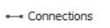
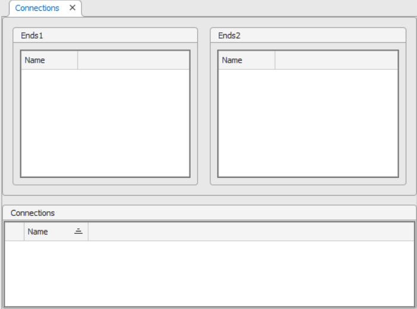
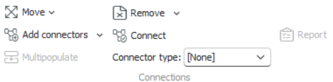
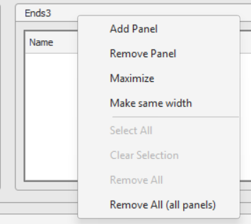
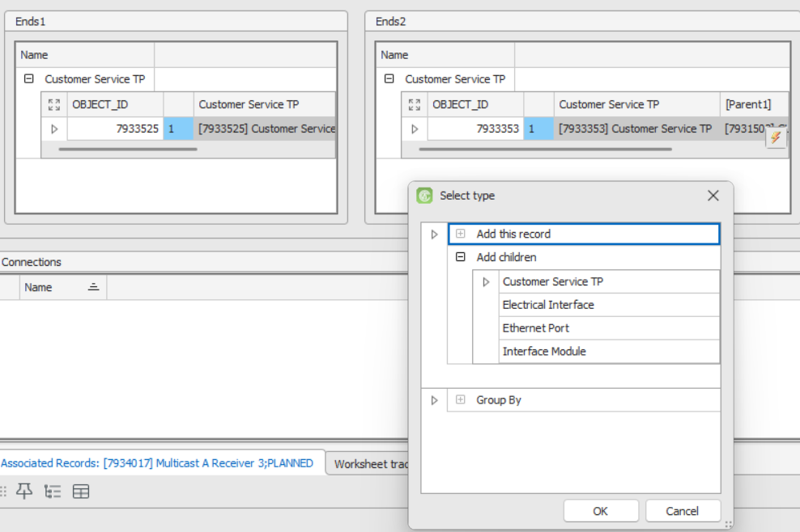
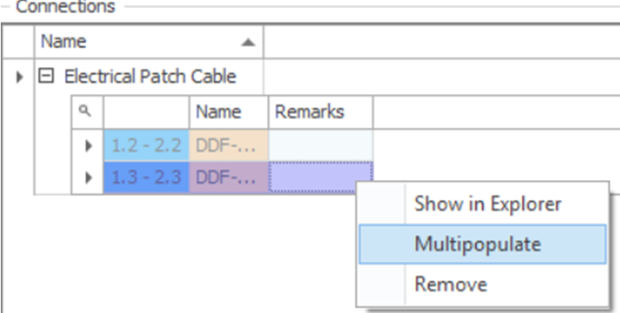

# Connections Workspace

The **Connections workspace** is designed for creating and managing multiple connectors simultaneously, allowing users to efficiently define relationships between network nodes. This workspace is particularly useful for bulk connection creation and editing, combining visual node selection with detailed connector configuration.

---

## Access & Overview

1. Start **Aktavara Console**.  
2. From the **Tools** menu, select **Connections**.  
   The workspace opens with two **node panels** (e.g., *Ends1* and *Ends2*) representing connection endpoints and a **connections panel** that displays created links.

Each node panel represents one side of a connection. You can move, resize, or add additional panels to connect nodes across multiple endpoints.

> 💡 **Tip:** Panels can be repositioned by dragging, or through toolbar commands **Move Left** / **Move Right** for better workspace organization.

---

## Managing Panels

### Adding & Managing Endpoint Panels

- **Add a panel:** Right-click a panel header and select **Add Panel**.  

- **Maximize / Restore:** Right-click the panel header → choose **Maximize** or **Restore**.  
- **Reorder panels:** Drag them directly or use **Move Left / Move Right** commands.  

This flexible setup allows multi-step workflows — for example, connecting nodes in Panels 1 and 2, then reordering and connecting Panels 2 and 1.

---

## Adding Nodes to Connect

Nodes define the endpoints of your connections.

1. Drag nodes from **Network Explorer** to the node panels (*Ends1*, *Ends2*).  
   If connector types are ambiguous, the **Select Type** dialog box appears — choose the correct node type and click **OK**.  
2. (Optional) Group nodes in panels by parent entities by enabling checkboxes in the **Group By** section.  
   This organizes nodes hierarchically for easier navigation.  
3. Alternatively, right-click a node in **Explorer**, select **Connections**, and choose a target panel or **New Panel** to add it automatically.

> ⚠️ **Note:** If the node cannot be linked based on design-time rules, an appropriate type selection dialog appears for clarification.

### Removing Nodes
- **Remove Ends:** Use **Remove Ends** from the toolbar to clear nodes selectively:  
  - *Saved Endpoints*  
  - *Unsaved Endpoints*  
  - *All*  
- **Remove All:** Clears the entire workspace including connections.

---

## Creating Connectors

Once nodes are in place, use the **Connections workspace** to create connectors between them.

### Connector Creation Methods

- **Linear Connections:**  
  Connects nodes one-to-one (first to first, second to second).  
  - Toolbar: **Add Linear**  
  - Context menu: *Add connection on linear selection*  

- **Add on Selection:**  
  Connects selected nodes across panels.  
  - Toolbar: **Add on Selection**  
  - Context menu: *Add on selection*  

- **Connect to All Nodes:**  
  Connects one or more selected nodes in one panel to **all** nodes in another.  
  - Context menu: *Add connections to all Ends2 nodes*  

- **Interactive Creation:**  
  Use the **Create Connector by Clicking** tool to manually click two nodes to create a connection between them.

> 💡 **Tip:** After connectors are created, review them in the **Connections Panel**, where each entry represents a created link between nodes.

### Selecting Connector Type
When connectors are added, the **Connector Type Selector** dialog appears.  
Double-click a connector type to apply it. The connectors are created and displayed instantly.

### Removing Connectors

- **Context Menu:** Right-click and select **Remove**.  
- **Toolbar:** Choose **Remove Connections**, with sub-options to remove *Saved*, *Unsaved*, or *All* connections.  
- **Remove All:** Clears both endpoints and connectors.

---

## Filling in Connector Details

After creating connectors, use the **Spreadsheet panel** to edit or populate connector attributes.

### Using Multipopulate

To quickly assign values to multiple connectors:

1. Select the connectors in the **Connections Panel**.  
2. Right-click and choose **Multipopulate** (or use the toolbar button).  
3. The **Multipopulate dialog** allows generation of attribute series such as:  
   - Sequential numbering.  
   - Common prefixes/suffixes.  
   - Incremental numeric fields.

> 💡 **Tip:** Multipopulate is ideal for bulk naming, numbering, or labeling of connectors.

For more advanced data manipulation, see the **Multipopulate** section in the *Spreadsheet Workspace* guide.

---

## Saving & Finalizing

- Click **Save** on the main toolbar to commit your created connections.  
- Saved connectors appear in their associated **Explorer** and **Spreadsheet** views for further management.  

> ⚠️ **Note:** If you exit without saving, unsaved connectors and node configurations will be lost.

---

