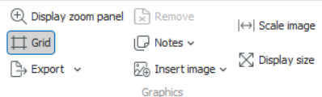
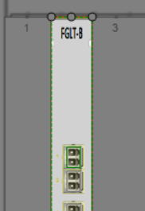
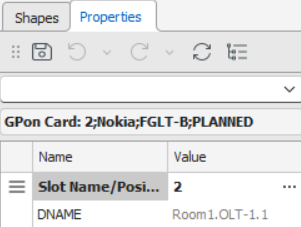
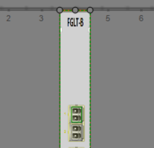
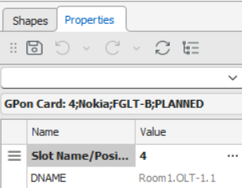
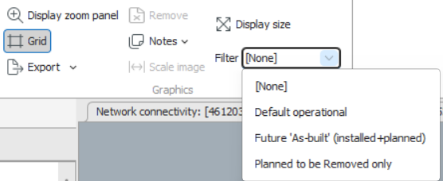

# Graphics Workspace

The **Graphics Workspace** provides a visual environment to view, design, and interact with network nodes at multiple levels of detail — from individual ports and cards to racks, sites, and even entire network maps. This workspace helps users manage network elements visually, following rules and templates defined in **Aktavara Designer**.

Shapes, layouts, and visual behaviors are configured by administrators and can be linked to attributes, rules, or types. For example, colors can reflect **status**, or rules can control where certain cards can be positioned. The workspace supports multiple hierarchy levels of child nodes.

---

## Starting the Graphics Workspace

To open the Graphics Workspace:

1. Launch **Aktavara Console**.  
2. In the **Explorer Workspace**, expand **Nodes** and double-click the node you wish to view.  
3. Alternatively, double-click a node in the **Spreadsheet Workspace**.  
   > ⚠️ **Note:** Not all node types have associated graphics.  
   > Some nodes may load their parent’s graphics (for example, double-clicking a port may open the rack view).

---

## Using Images in Free Shapes

**Free shapes** are generic shapes that can contain images — often used for floor plans or maps to visually represent equipment placement.

### To insert an image into a free shape:

1. Open a node that has a free shape.  
2. Click **Insert Image** in the toolbar (or press **Ctrl + Shift + B**).  
3. Select an image file (e.g., a floor plan) and click **Open**.  
4. Choose whether to preserve or stretch the image’s aspect ratio.  
5. In the **Scale Image** dialog, draw a line and enter its real-world length in millimeters to set scale.  
6. To replace or remove the image:  
   - Replace by repeating the insert process.  
   - Remove via **Insert Image → Reset Image**.  

You can also add **node shapes** on the image and rotate them to represent real-world layout. Select a shape and drag its red handle to rotate as needed.

---

## Working with Shapes

The workspace allows users to move, reposition, or recolor shapes based on node attributes.

### Relocating Equipment

1. Open the Graphics Workspace for the target shape.  
2. Select a shape (node) — its placement attribute (e.g., *Slot*) appears in the property sheet.  
3. Drag the shape to a new location, or manually update the slot value in the attribute field.  
4. You can also use the **Position / Slot Window** in the Properties panel:  
   - Click the button next to the placement attribute (e.g., *Position*).  
   - In the **Select Graphics Position** window, available slots are white, occupied slots are gray, and the current one is green.  
   - Click a new slot and select **OK**.  
   - Click **Save** to confirm.  

The node is now repositioned according to the selected slot.

    

*relocated*

     

### Changing Color Based on Attributes

1. Open the Graphics Workspace for the relevant node.  
2. Select a shape — its attributes appear in the **Property Sheet**.  
3. Modify the relevant attribute (e.g., *Status*) and click away to refresh the workspace.  
4. The shape color updates automatically according to the configured rule.

### Opening a Shape in a Separate Workspace

1. Right-click a shape and select **Open → Workspace**.  
2. The selected shape opens in its own workspace for detailed editing.

### Searching from the Graphics Workspace

1. Right-click an empty area and select **Search** → choose the search option.  
2. Search results appear based on your chosen criteria.

---

## Zooming and Panning

To navigate complex diagrams:

1. Select **Display Zoom Panel** from the toolbar.  
2. Adjust the zoom slider or drag the red frame in the preview to move around.  

---

## Adding and Managing Notes

### Adding a Note

1. Right-click an empty workspace area and choose **Add Note**.  
2. A note box appears — double-click to edit its content.  
3. Click **Save** to confirm.

### Removing a Note

1. Select the note.  
2. Press **DEL**, then click **Save** to remove it.

---

## Displaying Dimensions

To display shape measurements:

1. Click **Display Size** on the toolbar or right-click an empty area and select **Display Size**.  
2. Measurements appear on the active workspace for all visible shapes.

---

## Exporting Shapes as Images

To save workspace visuals for documentation or reporting:

1. Click **Export** on the toolbar.  
2. In the **Image Exporter** dialog, define bounds (X, Y, Width, Height) and select format.  
3. Click **Save To File**, name the image, and choose a folder.  
4. The image file is stored locally.

---

## Using Resource Templates

**Resource Templates**, defined in **Aktavara Designer**, allow users to create template-based entities (such as nodes) with predefined attributes and structure.

### To create a new entity using templates:

1. Right-click a shape and select **New from Template**.  
2. Choose from available templates or subcategories.  
3. Depending on settings:  
   - A **Spreadsheet Workspace** may open to edit and save attributes.  
   - A **Connections Workspace** may open for connector creation.  

---

## Filtering the Graphics Workspace

Filters can restrict the view to only show equipment that meets certain **status** or **workflow** conditions. If these are not defined, the filter option will not appear.

### Applying a Filter

1. Open the Graphics Workspace.  
2. From the filter dropdown in the toolbar, choose the filter to apply.  
3. Hover over filters to view their underlying status expressions.  
   
   > **Filter [none]** shows all equipment.

---

