# IP Address Manager (IPAM)

The **IP Address Manager (IPAM)** module in Aktavara Console provides a structured, rule-driven way to manage IP networks, ranges, and address assignments.

IPAM is deeply integrated with the network model and supports:

- Automated validation of IP data  
- Bulk generation of IP ranges and addresses  
- Schema-based assignment rules to devices/services  
- Advanced maintenance operations (merge, split, scale ranges, swap assignments, etc.)  

---

## IPAM Concepts

IPAM manages three main data objects plus configuration schemas that control how IPs are assigned.

### **IP Scope Name**

A logical container representing a network or administrative boundary.

- Example scopes: **Core**, **Access**, **Management**  
- Scopes help divide address spaces into meaningful groups.  

### **IP Ranges**

A block of IP addresses, optionally defined as a **subnet** (with a subnet mask).

- Ranges belong to scopes.  
- Ranges can be **subnets** (aligned to subnet rules) or just **free ranges** of addresses.  
- Ranges can also be flagged as **reserved** so they are skipped when assigning IPs (e.g., pre-used or blocked sub-ranges).

### **IP Addresses**

Individual address records that:

- May be assigned to nodes (routers, ports, services, etc.), or  
- Remain unassigned for future use.  

### **Assignment Schemas & Targets (Conceptual Overview)**

In addition to scopes, ranges and addresses, IPAM uses **Assignment Schemas** that describe *how* addresses are assigned:

- **Schema** – a configuration object that defines:
  - The IP version (IPv4 / IPv6)  
  - Whether targets are retrieved **manually** or **automatically**  
  - What **targets** (records) participate (e.g., routers, ports, services)  
  - Which **source ranges** can be used  
  - Optional **grouping parent** (so multiple targets are assigned together)  
  - Optional **consecutive allocation rules** and **cross-format masks**  
- **Targets** – the records that receive IPs.  
- **Assignments** – the relationship “this target has this IP range/address”.

The **IP Assignment Workspace** is where schemas, targets, and ranges come together into actual IP assignments.

---

## IPAM in Network Explorer

IPAM appears as a dedicated section in **Network Explorer**, with the following structure:

```text
IPAM Root  
   └── IP Scope (Network Name)
          └── IP Ranges
                 └── IP Addresses
```

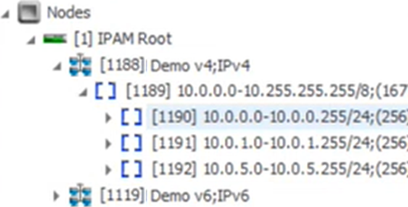  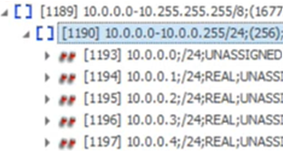

Each element is defined in **Designer**, where you can:

- Configure naming conventions  
- Add custom attributes  
- Define validation rules and schema behavior  

---

## IPAM Node Properties

All IPAM nodes (Scopes, Ranges, Addresses) have editable properties visible in the **Properties** panel.

### Editing Rules

- **Unassigned ranges** can be edited directly in Properties.  
- If a range has **IP assignments** via schemas, it becomes **locked** and its IP-related fields must be changed in the **IP Assignment Workspace**, so all validation and synchronization rules are respected.  

### Property Toolbar Actions

For IP-related fields, the toolbar offers:

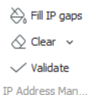

| Feature | Purpose |
|--------|---------|
| **Fill the gaps** | Auto-generates missing IP values (start/end/mask/count) using schema/range rules |
| **Clear** | Clears generated IP data (for selected fields or all IP-related fields) |
| **Validate** | Performs a **pre-validation** of values before saving |

> **Pre-validation vs Save Time Validation**  
>
> - Pressing **Validate** runs the checks immediately and shows messages in the **Operational Status** column.  
> - Pressing **Save** also triggers validation. Depending on configuration, the user may:  
>   - Be **blocked** by hard errors, or  
>   - See **warnings** and decide to **confirm and proceed** despite validation failures.

---

## IPAM Range Workspace

The **IP Range Workspace** is an enhanced spreadsheet view for IP ranges and addresses:

- Mirrors the tree structure shown in Network Explorer.  
- Efficient for bulk operations (create, split, clear, validate).  
- Changes remain **unsaved** until you press **Save**.  

### Accessing the Range Workspace

When you work on children of the **IPAM root**, the system activates the IP Range spreadsheet view automatically for those types.

You can:

- Double-click a range (when configured, see below)  
- Or open the range in spreadsheet mode via context/menu actions.

## Configuring Double-Click for IPAM Ranges

To make double-click open the tree-like spreadsheet instead of the graphical workspace:

1. Open Console **Info Menu** (top-left menu).  
2. Go to **Explorer** tab → **Add**.  
3. In *Edit Actions*:  
   - Type: `IPAM_RANGE`  
   - Action: **Show children in tree list**  
4. Click **OK**.  

If double-click behavior does not persist between sessions, simply revisit this setting and re-apply the action.

## Tree-Like Navigation

In the workspace, ranges can appear in a tree inside the spreadsheet:

- Parent range on the first level  
- Child ranges indented beneath  
- Expanding a child reveals **its** children, and so on  

This lets you navigate the hierarchy of scopes, ranges, and sub-ranges without leaving the spreadsheet.

## Range Toolbar Functions

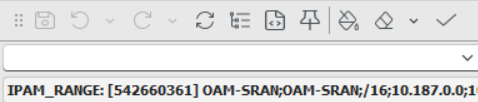

The Range toolbar can:

- **Fill IP gaps**   
  - From **mask only**: give only subnet masks; the system finds the first available start/end addresses.  
  - From **mask + start address**: the system computes the end address.  
- **Clear values**  
  - Clear **Start IP**, **End IP**, or **all IP fields** for the selected rows.  
- **Validate**  
  - Pre-validate ranges before saving, showing messages if ranges overlap or break rules.


---

## Managing IP Addresses & Ranges

### Adding IP Addresses to a Range

#### Method 1 – From Context Menu

1. Select the target **IP Range**.  
2. Right-click → **New → IPAM_ADDRESS**.  
3. Fill in required details (Scope, Subnet mask, etc.).  
4. Click **Fill the gaps** to auto-populate missing IP-related fields.  

#### Method 2 – Using Spreadsheet Toolbar

1. Open an IP Range in **Spreadsheet** view.  
2. Use **Multiply By** to create multiple empty address rows.  
3. Click **Fill the gaps** to auto-assign correct addresses.


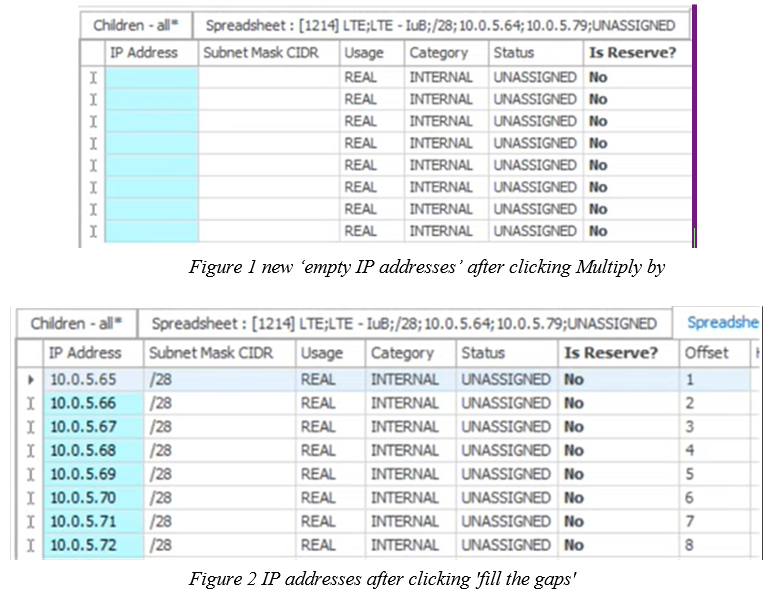


---

### Merging IP Ranges

Use merging to consolidate two or more existing ranges into a larger unified range.

> **Important:** Create the temporary combined range in a **different scope** to avoid consistency rule violations.  

Steps:

1. Create a new range large enough to contain all the overlapping ranges (in a temporary scope).  
2. Drag IP addresses from old ranges → drop into new range → choose **Move**.  
3. Adjust the subnet mask if needed.  
4. Delete the now-empty old ranges.  
5. Move the new range back to the original scope.

---

### Splitting IP Ranges

Splitting allows you to break one range into multiple smaller ranges.

1. Create the new smaller ranges in a **temporary scope**.  
2. Move addresses from the original range into their corresponding new ranges.  
3. Delete the now-empty original range.  
4. Move the new ranges back to the original scope.  

You can speed this up using **resource templates** and **Multiply By** (see below).

---

### Scaling Ranges (Expand / Shrink)

To change the size of a range:

1. Select the range.  
2. Modify the **Subnet mask** (e.g., `/27 → /26`).  
3. Clear **Number of addresses**.  
4. Click **Fill the gaps** to regenerate the correct address count and boundaries.  

---

### Creating Ranges from Resource Templates

Templates allow consistent, repeatable creation of range hierarchies.

#### Basic Template Usage

1. Select an **IP Scope** or existing **IP Range**.  
2. Right-click → **Resource templates → New from Template → [Template]**.  
3. Enter values such as Scope, Subnet mask, and **Multiply By**.  
4. Click **Fill the gaps** to generate IP addresses for all template records.  

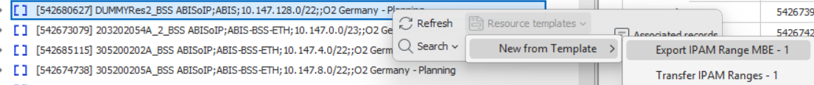

**Example – Splitting a /29 into Two /30s**

1. Right-click on the `/29` range → choose a simple template with **one IPAM_RANGE**.  
2. Adjust the first row to `/30`.  
3. Use **Multiply By = 2** to duplicate that row.  
4. Click **Fill the gaps** – the system calculates start/end addresses for both /30 ranges.

#### Advanced Templates

Templates can also contain:

- A **parent range** (e.g., `/24`)  
- Multiple **child ranges** (e.g., `/28` each)  
- **Child addresses** under each /28  

When you multiply such a template and press **Fill the IP gaps**, all levels (parent, children, addresses) get consistent, non-overlapping IP values.

---

### Range vs Subnet & Reserved Ranges

In the IP Range model - configured in Aktavara Designer:

- A **Range** is any contiguous block of addresses.  
- A **Subnet** is a range whose **first address** aligns to subnet rules (e.g., divisible by `2^(32 – mask)` in IPv4).  
- Some customers import pure ranges that are *not* proper subnets, so both are supported.

Additional flags:

- **Subnet? (Yes/No)** – indicates whether the range behaves as a real subnet.  
- **Reserved? (Yes/No)** – marks ranges or addresses that are already used elsewhere or should not be assigned.  
  - The assignment engine will **skip reserved objects** when offering values in the Assignment Workspace.  

---

## Changing an IP Range

### Changing Unassigned Ranges

If the range is **not assigned** via a schema:

- Edit IP fields directly in the **Properties** window or Range workspace.  
- Optionally press **Validate** to pre-check.  
- Press **Save** to persist changes.  

### Changing Assigned Ranges

If the range is part of an **IP assignment**:

- IP-related fields are **read-only** in Properties.  
- Use the **IP Assignment Workspace** to change values, so grouping & synchronization rules are respected and dependent objects are updated correctly.

---

## Deleting an IP Range

1. Select the Range → Right-click → **Delete**.  
2. Choose:
   - **Delete this node**, or  
   - **Delete this node and related connectors**  
3. Confirm deletion.  

If the range is still assigned, a **dependency window** may block deletion until you remove those assignments via the IP Assignment Workspace.

---

## IPAM Assignment Workspace

The **IP Assignment Workspace** provides a central place to:

- Assign IP ranges or addresses to targets  
- Apply schema rules (grouping, consecutiveness, masks)  
- Validate assignments  
- Review assigned, unassigned, and orphaned records  

Open via: **View → IP Assignment**.  

When opened:

- A new Assignment tab loads for the first schema.  
- The Assignment toolbar appears in the main window.

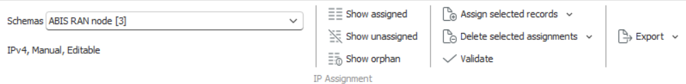

---

### Understanding Schemas

Schemas define *how* IP addresses are assigned.

Schema attributes include:

- **IPv4 or IPv6**  
- **Manual vs Automatic** targets  
  - *Manual*: user drags & drops targets into the workspace.  
  - *Automatic*: system retrieves targets according to schema rules (e.g., all ports/topologies matching filters).  
- **Editable IP values** (which fields are user-editable).  
- **Assignment rules**, including:
  - Source ranges  
  - Grouping parent behavior (synchronized assignment for multiple targets)  
  - **Consecutive allocation** requirements across multiple rules  
  - **Cross-format masks** for constructing related IPs (e.g., same last octet).  
- **Validation rules**, defining what should be checked and how failures are handled.

> **Note on IPv6**  
> IPAM can assign IPv6 addresses in schemas similarly to IPv4.  
> Depending on platform version, some helper features (such as derived “full address” string fields or IPv6 cross-format masks) may be limited, but the core assignment logic works the same way.

---

### What You See in the IP Assignment Workspace

Each row in the Assignment spreadsheet represents a **target record** for a given schema and rule. Typical columns are:

- **Target record** – clickable to open Properties or locate in Explorer.  
- **Type** – the exact type name (e.g., router, port, service).  
- **Instance** – instance number (1, 2, 3, …) when a target appears multiple times under the same grouping parent.  
- **Grouping parent** – the object that groups several targets together for synchronized assignments.  
- **Assignment rule** – the rule name used by this row.  
- **Source** – what the assignment uses (IP range or IP address source).  
- **Current values** – the already-assigned data (Start address, Low bound, High bound, Subnet mask).  
- **New values** – proposed values (New start, New end, New mask) used when creating or changing assignments.  
- **Operational Status** – messages from validations and allocation logic (errors, warnings, or OK).

When you **save**, values from **New** columns are copied into **Current** columns for successful rows.

---

### Filtering in the Assignment View

Toolbar filters determine which records are shown:

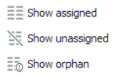

| Filter | Meaning | Typical Use |
|--------|---------|-------------|
| **Show assigned** | Display only rows that already have valid IP assignments | Review what is currently in use |
| **Show unassigned** | Display rows that have **no** assignment yet | Work lists when creating new assignments |
| **Show orphan** | Show rows where an assignment exists, but the target or source **no longer matches** the schema filters | Clean up after model changes (e.g., attribute changed so target no longer qualifies, or source range is no longer valid) |

- For **automatic schemas**, *Show unassigned* is particularly useful to see new targets discovered by the schema.  
- Use **Show orphan** to identify assignments that need to be fixed or removed.

---

### Assignment Actions

Actions depend on schema definitions, and are exposed via toolbar and context menus.  

#### Toolbar Actions

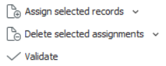

- **Assign Selected / All records**  
  - Runs the allocation algorithm for selected rows only.
  - ALL / Bulk allocation for every visible row in the workspace – useful for mass rollout of IPs from a range.  

- **Delete Selected / All assignments**  
  - Removes assignments for selected  or all rows. When targets are grouped, related assignments may also be removed.  
- **Validate selected records**  
  - Runs validation logic on selected rows (pre-validation, before saving).

#### Context Menu Actions

On right-click:

- **Assign** / **Assign selected records** – same as toolbar, but scoped to your selection.  
- **Delete assignment** – remove the assignment for those rows.  
- **Swap Assignments** – swap IPs between two compatible targets.  
- **Cascading Swap** – swap IPs between two targets **and all dependent child assignments**.  

---

### Working With Assignment Spreadsheet

#### Creating a New Assignment

Typical workflow:

1. Open **View → IP Assignment** and choose a **Schema**.  
2. Ensure the desired targets are visible (drag-and-drop manually, or rely on automatic retrieval).  
3. Select one or more target rows.  
4. Provide **new IP values** via one of:
   - **Assign selected records** (let the schema allocate automatically),  
   - Typing a valid start address and pressing **Tab**, or  
   - Using the **New address picker** (see below).  
5. Optionally press **Validate** to pre-check.  
6. Press **Save**.  
   - Values from **New** columns move into **Current** columns for valid rows.  

#### Using the New Address Picker

The **New Start Address** picker:

- Shows all **eligible source values** (ranges/addresses) for the rule.  
- Entries with a **“-”** icon may represent values that do not exist as separate records but are valid numerically.  
- **Greyed out** values are unavailable (already assigned or blocked).  
- In synchronized schemas, picking one value may cause **other rules in the same group** to auto-populate consistent values.

Tips:

- Hold **CTRL** when opening the picker to auto-filter by the current address.  
- Use search and column reordering to quickly find suitable values.

#### Changing Existing Assignments (Reassignment)

To change an existing assignment:

1. Select the row with an existing **Current** value.  
2. Enter a different IP in **New start address** (or pick a new value from the picker).  
3. In schemas with synchronization, related rules in the same group will receive adjusted values automatically.  
4. Press **Save** to apply.  

This operation is a **reassignment**: the old assignment is replaced by the new one. Depending on schema flags, old IP objects may be removed or reused.

#### Deleting IP Assignments

To delete assignments:

1. Select the row(s).  
2. Use **Delete selected assignments** (toolbar) or **Delete assignment** (context menu).  
3. In grouped schemas, deleting for one target can also delete for all targets in the same grouping parent.  
4. Press **Save** – the row(s) will appear as **unassigned** again.

---

### Special Assignment Use Cases

#### Swap Assignments

Use **Swap Assignments** to exchange IPs between two compatible targets:

- Both rows must use **the same assignment rule(s)**.  
- They must have **different grouping parents**.  
- After swap:
  - The IP values for each rule move from one target to the other, rule by rule.


Select the two records you want to swap:

1. Open the context menu and select **Swap Assignments.**

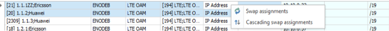

This results in the following 

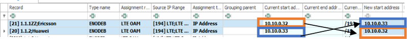

#### Cascading Swap Assignments

**Cascading Swap** extends swap behavior to dependent child assignments:

- Used when you also want all **child ranges/addresses** to move consistently.  
- For example:
  - Level 1 ranges for two routers are swapped, and  
  - Level 2 child ranges/addresses assigned beneath them are also swapped.  

If you use regular **Swap**, children remain where they are; with **Cascading Swap**, children move together with the parent range.

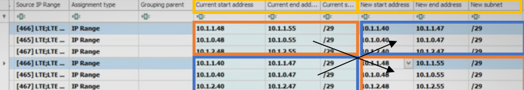

---

## Assignment Validation & Messages

Schema-defined validation rules check IP assignments. Failures appear in **Operational Status**:

- **OK / informational** – validation passed.  
- **Warnings** – issues detected, but user may still **confirm and save**.  
- **Errors** – blocking problems; assignment cannot be saved.

Behavior:

- Pressing **Validate** runs checks without saving.  
- Pressing **Save** runs the same checks again.  
- When warnings exist:
  - A confirmation dialog lets the user decide whether to proceed despite validation failures.  
- When errors exist:
  - Saving is blocked until issues are resolved.

Validations can inspect the full context (targets, sources, masks, grouping, consecutiveness, etc.) and return custom messages to guide the user.

---

## Consecutive Addresses and Cross-Format Masks

Some schemas require **consecutive** IP addresses across multiple rules belonging to the same grouping parent:

- Example: three rules (CP, IPSec, UP) must receive consecutive addresses from the **same source range**.  
- The engine:
  - Picks the first available address for the first rule.  
  - Allocates subsequent addresses for the following rules.  
- If there is not enough room (e.g., required consecutive block is already partially used), the user receives an error such as *“no consecutive IP address found”* and must pick a different source.

**Cross-format masks** can be used to:

- Keep specific parts of the address identical across rules (e.g., same last octet, or specific digit in the 3rd octet).  
- Enforce relationships between IPv4 and IPv6 representations (where supported).

---

## IP Addresses in Properties & Associated Records

When a node has IP assignments:

### 1. Properties Window

Assigned addresses appear as attributes in the **Properties** window:

- Usually read-only, showing the current IPs and masks.  
- Help you verify which IPs are attached to which object without opening the Assignment Workspace.  

### 2. Associated Records

- Selecting a **node** shows associated IP ranges/addresses.  
- Selecting a **range/address** shows the node(s) it is mapped to.

This makes it easy to navigate between assignments and network elements from either direction.
