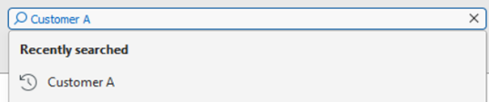
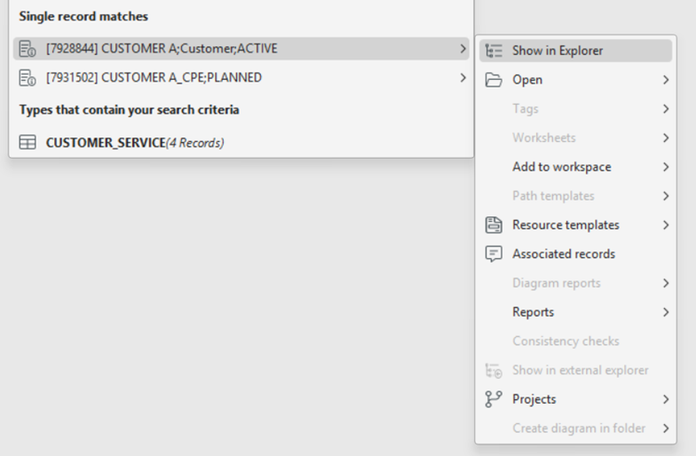
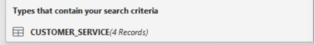
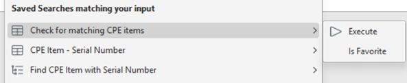

# Instant Search

The **Instant Search** feature provides users with a fast and intuitive way to locate records, objects, and data types directly from the top of the application interface. Positioned above the main ribbon, it acts as a universal entry point for keyword-based searches across indexed data types.

---

### Core Functionality

Instant Search allows users to type in any keyword or text string to quickly retrieve matching items from within the application. As the user types, the system searches through all **indexed record types** that have been preconfigured in the **Designer module**. There is no fixed limit to the number of types that can be included—administrators can configure as many as needed for the environment.

Search results dynamically appear in a list, showing all records that contain the input string within the defined search properties.

---

### Search Results and Interaction

- **Exact Matches:**  
  When a search produces a single, exact match within a record type, that item appears as a dedicated entry in the results list. From there, the user can open the **context menu** and perform any available actions—just as they would on the same record in the **Network Explorer**.

  
  
- **Multiple Matches:**  
  If a search returns multiple records for a particular type, the system opens the results in a **spreadsheet workspace**. This allows users to review, sort, or filter the matching records to locate the specific one they need.
  
  

---

### Recent and Saved Searches

Instant Search keeps a history of **recently used search terms**, enabling users to quickly repeat previous queries. It also displays any **saved searches** that match the current input. Saved searches can be executed directly from the results list, allowing users to re-run common or complex searches with a single click.

---

### Search Configuration and Customization

The behavior of Instant Search is determined by the **search properties** defined within the **Designer module**:
- By default, searches are based on the **Description Format** property, which typically includes identifiers and record names shown in the Network Explorer.
- Designers can expand functionality by adding **additional properties** for specific record types, allowing users to search on a broader range of fields.

This configuration flexibility ensures that Instant Search can be adapted to different data models and user workflows without code changes.

---

