# Network Connectivity Viewer

## Open the Connectivity Viewer
*Open the read-only viewer for an existing Path/Diagram/Topology from Network Explorer and standard context menu*

1. From the **Network Explorer**, open a **Path** (or a **Diagram/Topology**).  

   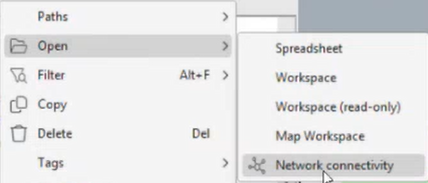

2. Double-click the record to open the **Network Connectivity Viewer** (read-only view of the same dataset).  

3. If needed, adjust the **double-click action** in settings to open the Connectivity Viewer by default.

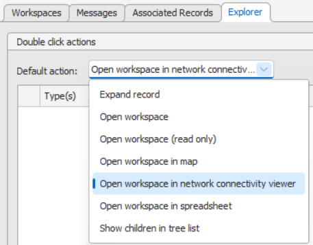

---

## Setting things up, if there is no defined layout for the selected type

### Add node types & set default layouts

*Add more types to the view and choose how each type is arranged.*

1. **Drag**  or **double click** desired types to the right column to include them in the control panel.  
2. In the layouts tab, for each type, choose a **default layout** (how that type is arranged on the map).  
   - Example: **Ethernet ports → East–West** to reflect left-to-right traffic flow.

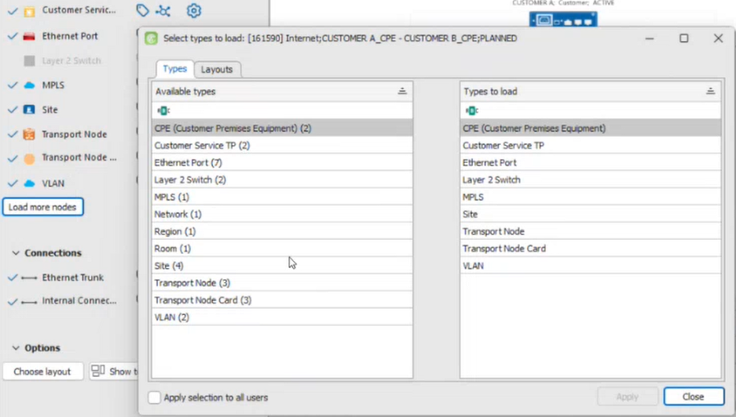

---

#### Apply defaults for everyone (if you have privileges)

*Publish your current type/layout selections as the default for all users.*

1. With elevated privileges, set your current type selections and layouts as the **default for all users** of that path type.  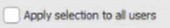
2. This is managed **in Console** (not in the Designer app).

### Compare multiple records on one canvas

*Load multiple datasets side-by-side to compare structures and links.*

1. **Drag additional records** from the Network Explorer into the same canvas to compare side-by-side.  

2. Shared nodes appear **twice** (one per dataset) and each dataset is **border-labelled**.  

   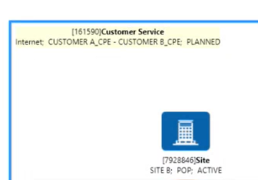

3. Use the **Loaded Records** list to **hide/show** a dataset.

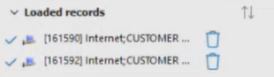

---

## Working with the Connectivity Viewer

### Canvas basics 

*Move around the canvas and select items for quick actions.*

1. **Click-drag** on the canvas to pan around.  
2. **Click** to select objects; **Shift-click** or drag a **blue selection box** for multi-select.  
3. Use the **context/right-click menu** on selected objects to:
   - **Open** the record in the traditional workspace (**Edit in Workspace**)
   - Access other quick actions

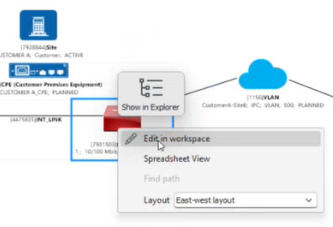

---

### Selection & properties
*See and adjust details for what’s currently selected.*

1. Selected items are highlighted with a **blue box** (multi-select shows multiple).  
2. The **Properties** panel updates based on your selection.

---

### Layers & visibility controls 
*Show or hide node types, clouds, and other layers to focus the view.*

1. Use the **control panel** to show/hide **layers** (e.g., node types, VLAN/IMPIs clouds).  
2. Changes apply immediately to the canvas (more end-user control than the legacy workspace).  
3. Toggle specific **node types** and **parent nodes** as needed.

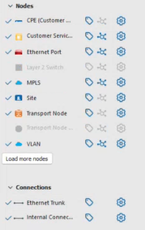

---

## Adjusting the Loaded content

### Labels & connectivity toggles

*Turn labels and link lines on/off to declutter or spotlight relationships.*

1. Toggle **labels** for:
   - **Node types**  
   - **Connections**  
2. Toggle **connectivity lines** to focus on specific relationships (e.g., show only **internal links** or connectivity within **Customer Services**).

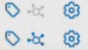

---

### Configure label content
*Customize what each label displays using fields, delimiters, and line breaks.*

1. Open click the cog icon  to customise **label text**.  
2. Choose fields (e.g., **Customer Name**, **Type Name**) and add **delimiters** (comma, “/”, line breaks).  
3. Preview updates before applying.  
4. Note: Some items may show empty fields if underlying data is missing.

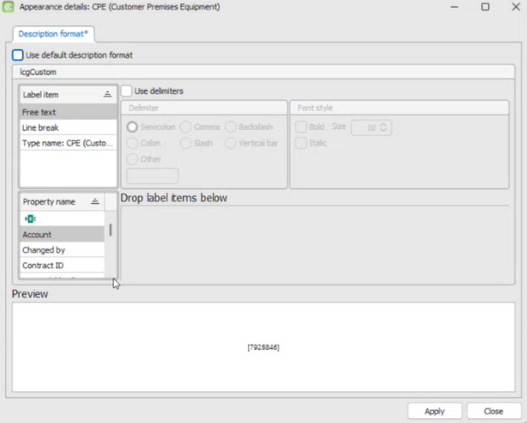

---

### Change the canvas layout
*Switch layout algorithms to best fit your topology and space.*

Right-click the canvas to switch **layout algorithms**:

- **Graph (auto/“layout graph”)**: optimal arrangement for general networks.  
- **Fixed / Circular**: fixed positions or loop arrangements.  
- **Spring**: spreads close nodes apart dynamically.  
- **Grid**: tidy grid alignment.  
- **East–West**: left-to-right flow (good for port/traffic views).  
- **Geographic Spring**: uses node coordinates (if available) to place nodes roughly by **real-world location**, while easing extremes.

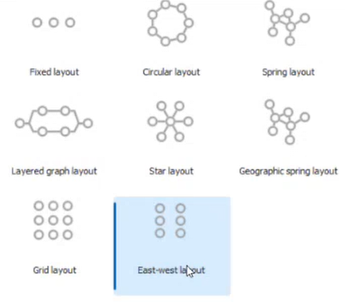

---

### Show borders around top node group
*Outline the current top-level group (e.g., Site, CPE, Transport) to aid orientation.*

1. Toggle **Group borders** to visually outline the top-level group.  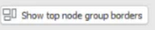
2. Switch which group is shown or visible to change the border context.

---

## Workspace Data Explorer (linked grid view)
*See the data behind the canvas in a synchronised, spreadsheet-style view.*

1. Open **Workspace Data Explorer** to see a **spreadsheet-style** view of loaded data (no separate tab needed).  
2. Selections are **synchronised**:
   - Selecting on the **canvas** highlights rows in the Data Explorer.  
   - Selecting rows in the **Data Explorer** highlights items on the canvas.

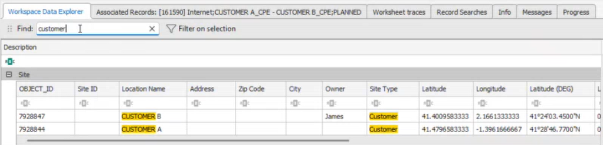

---

### Filter by selection for side-by-side comparison
*Narrow the grid to just the items you selected to compare properties quickly.*

1. Select multiple items (e.g., **four Ethernet ports**).   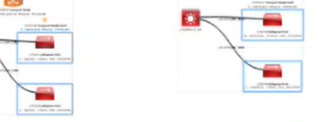

2. Click **Filter on selection** in the Data Explorer.  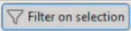

3. Compare **all properties** of the selected records in one view — no need to open multiple property panels or spreadsheets.

   

   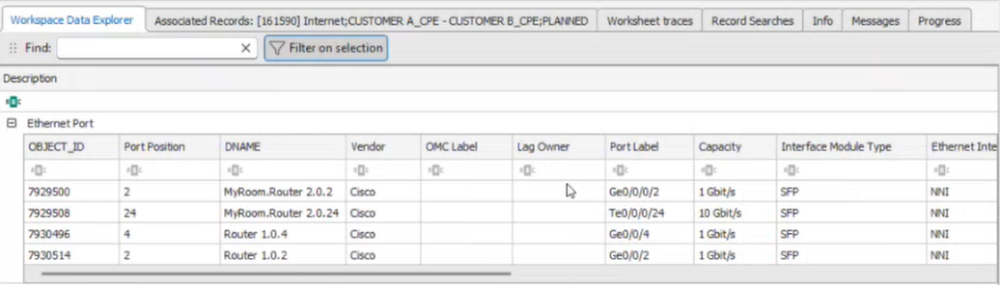

---
