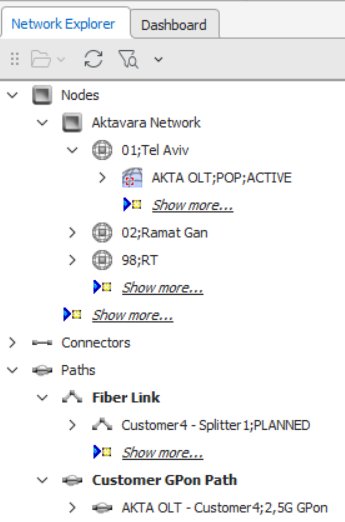

# Network Explorer

The **Network Explorer** workspace displays nodes, connectors, paths, topologies, carriers, collections, and diagrams in a hierarchical tree. It provides easy navigation, drag‑and‑drop operations, filtering, pagination, and context‑menu actions.

When more than 100 items exist under a branch, Explorer automatically paginates them, showing a **Show more** entry to load additional records.

---

## General Explorer Commands

### Filter
1. Select the root of a sub‑tree.
2. Click **Filter** in the Network Explorer mini toolbar.
3. Enter filter text → press **Enter**.
4. Explorer displays filtered results with the filter value shown in the label.
5. Remove via **X** in the Filter dialog.

### Refresh
Hover an item → click **Refresh** on mini toolbar.

### Lock / Unlock Records
Right‑click an item → **Exclusive lock**.  
To unlock → **Unlock**.

### Search All
Right‑click a type (Connector, Path, Collection, Diagram) → **Search All**.  
Results appear in Spreadsheet workspace.

---

## Nodes

### Insert New Node
Find parent → right‑click **New Node** → choose type → fill Properties → Save.

### Edit, Remove, Copy/Move Nodes
- Edit via Properties → Save  
- Remove via **Delete** → confirm  
- Copy/Move by drag‑and‑drop → choose **Copy** or **Move**

---

## Connectors

### Create Connector
Either:
- Ctrl‑click two nodes → right‑click → **Add Connector**, or  
- Right‑click source → **Connect from**, right‑click target → **Connect to**

### Remove / Edit Connector
Right‑click connector → **Delete Connector** → confirm  
Edit via Properties

---

## Paths

Create via **New Path**, edit in Path workspace, save.  
Delete via context menu; copy via **Copy Path**.

---

## Topologies

Create via **New**, edit in Topology workspace, save.  
Delete via context menu; copy via **Copy**.

---

## Carriers

Create via **New**, edit in Carrier workspace, save.  
Delete or copy via context menu.

---

## Collections

Create via **New**, populate via drag‑drop into Collection workspace, save.  
Delete or edit via context menu and Properties.

---

## Diagrams

Create via **New**, edit in Graphics workspace, save.  
Delete via context menu.

---

# Resource Templates in Network Explorer

Resource templates are predefined models created in **Aktavara Designer**. They define:

- A ready‑made structure (child elements, hierarchy)
- Default attribute values
- Optional rules for auto‑generation of connectors
- Constraints and behavior for template‑based entities

In Aktavara Console, these templates allow users to create **consistent, repeatable network resources** without manually building structures.

Templates appear in right‑click menus for entities configured to support them.

---

## Creating Records From Templates

When a template is linked to an entity type (e.g., a Node type), you can create a new instance based on that template.

### Workflow
1. Expand to the entity that has template support (e.g., Nodes).
2. Right‑click the parent → **New from Template**.
3. Choose a template from categorized menus.
4. Depending on template rules:
   - A **Spreadsheet workspace** may appear for attribute completion.
   - A **Connections workspace** may appear for guided connector creation.
5. Save the generated records.

This ensures structural correctness and consistent data modeling across the network.

---

# Template Versions & Upgrades

Templates may evolve over time. New versions introduce:

- Updated attribute defaults  
- Additional child elements  
- New structural rules  
- Adjusted connectivity expectations  

Objects created from earlier versions can be upgraded—preserving user data while adopting template improvements.

There are **two upgrade mechanisms**:

---

## Upgrade Node to New Template Version

This upgrade applies when:

- The record was created from a resource template **and**
- A newer version of the *same* template exists (flagged “Available in Console”)

### Workflow
1. Right‑click the node.
2. If an upgrade is available → **Upgrade from Template** appears.
3. Select the target version.
4. Console shows a spreadsheet with the proposed updated attributes/structure.
5. Save to apply the upgrades.

The system updates only attributes allowed by Designer rules (protected attributes remain unchanged).

---

## Cross‑Template Upgrade

This applies when:

- The record is mapped to one or more *other* templates (via Designer configuration)
- The Console determines that the record may be migrated into a different structure entirely

### Workflow
1. Right‑click node → **Records upgrade**.
2. Choose the target template or template version.
3. Spreadsheet shows the proposed changes.
4. Save to commit.

Cross‑template upgrades allow major structural changes (e.g., replacing equipment families) while keeping connectivity valid where possible.
