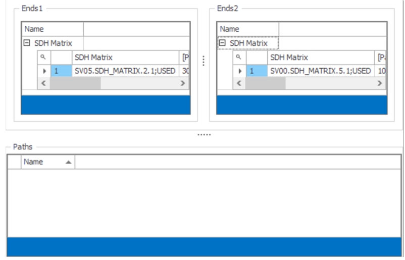
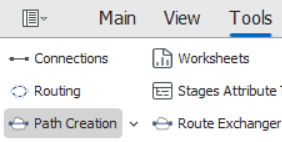
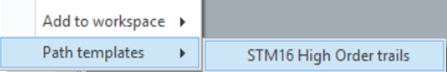
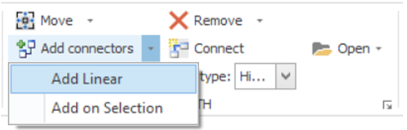
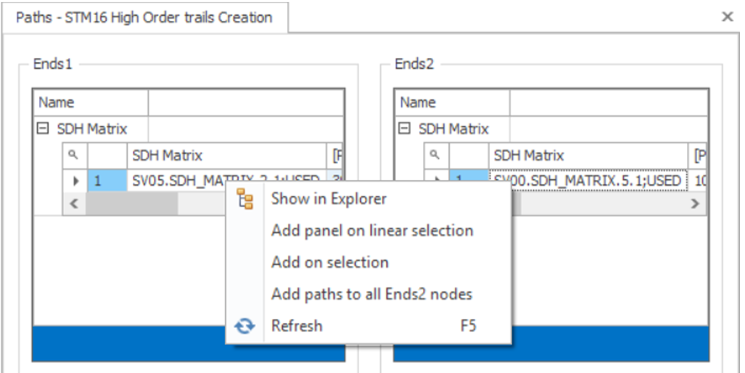
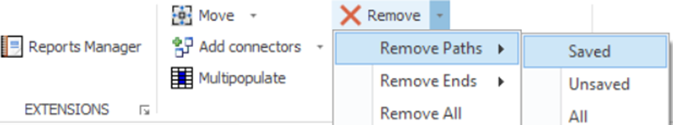
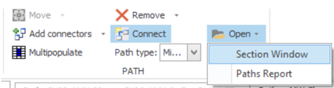

# Path Creation Workspace

The **Path Creation workspace** in Aktavara Console is designed for **bulk path creation**. It allows users to quickly generate multiple similar paths based on a selected template and the endpoint structure of an existing path. The selected reference path is included in all newly created paths.

The workspace contains:
- **Ends1 panel** – starting nodes  
- **Ends2 panel** – ending nodes  
- **Paths panel** – definitions of the paths to be created  

---

## Opening the Path Creation Workspace

You can access the workspace in two ways:

### Method 1 — Tools Menu
1. Start **Aktavara Console**.  
2. Go to **Tools > Path Creation**.  
3. Select a **template** from the list.

### Method 2 — From a Path (template‑dependent)
1. Right‑click a **path** in Explorer.  
2. Choose **Path templates**.  
3. Select the desired template.

The Path Creation workspace opens.

---

## Preparing Nodes

Ensure the nodes you want to connect appear in the **Ends1** and **Ends2** panels.

### View Properties
Click any item in the workspace to display its details in the Properties window for review or editing.

---

## Defining Paths to Create

You can define the new paths by pairing nodes from Ends1 and Ends2.

### Add Path Definitions

#### Toolbar options:
- **Add Linear** — pairs nodes in matching order (1→1, 2→2, etc.)  
- **Add on Selection** — pairs only the nodes you select

#### Right‑click options:
- **Add path on linear selection**  
- **Add on selection**  
- **Add paths to all Ends2 nodes**  
- **Add paths to selected Ends2 nodes**  
  (with equivalent options in the opposite direction)

> **Linear mode**: Node 1 in Ends1 pairs with Node 1 in Ends2, Node 2 with Node 2, and so on.

---

## Removing Nodes or Paths

You may remove items from both node panels and the Paths panel.

### Toolbar options:
- **Remove Paths → Saved / Unsaved / All**  
- **Remove Ends → Saved / Unsaved / All**  
- **Remove All** — clears all panels

### Right‑click option:
- Right‑click a path → **Remove**

---

## Multipopulate Values

Multipopulate allows you to auto‑fill a column for multiple selected path definitions.

### Using Multipopulate
1. Select several paths.  
2. Right‑click a column → choose **Multipopulate**.  
3. Fill values using the available options.

Or use the **Multipopulate** button on the toolbar.

> For detailed behaviors, see the *Spreadsheet Workspace* documentation.

---

## Viewing Path Structure and Reports

### Section Window
Click **Section Window** on the toolbar to preview the path **section** shared by all paths being created.

### Path Report
Click **Path Report** on the toolbar to generate a report containing **every newly created path**.

