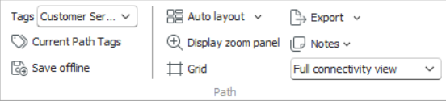
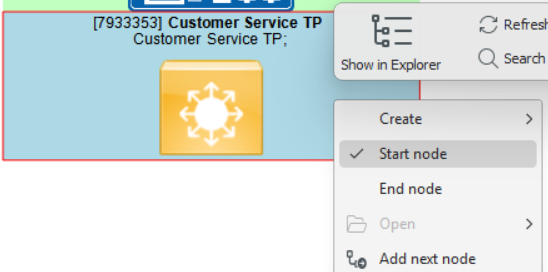
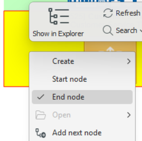
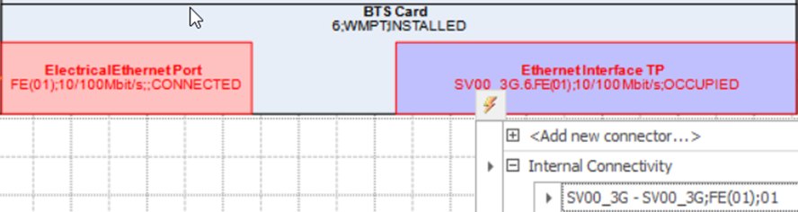
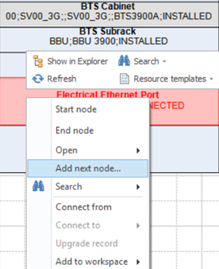
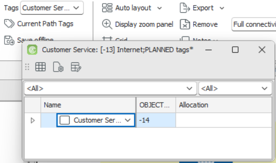
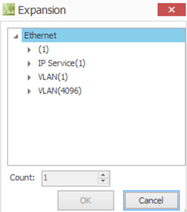
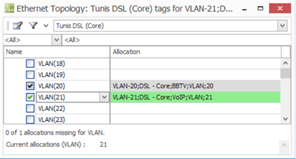
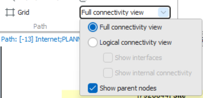
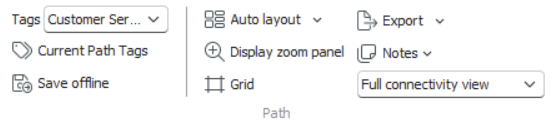

# Path Workspace

The **Path Workspace** is the primary environment for designing, viewing, and managing path records in the Aktavara Console. It allows users to visually construct network paths by connecting nodes and connectors, define capacity allocations through tags, and visualize both logical and physical relationships between network elements.

Each path record represents a network route or logical link composed of nodes, connectors, and optionally subpaths. The workspace presents these visually in a diagram with nodes as rectangles and connectors as connecting lines.  
Users can pan, zoom, or switch between logical and physical connectivity views to navigate and analyze the structure.

> 💡 **Tip:** A valid path must include one *start node*, one *end node*, and all intermediate nodes must be connected for the system to save the record successfully.

---

## Defining Tag Association for a Path

A **path’s capacity** is defined through a **tag hierarchy**, which models how capacity is split into allocation units (e.g., fibers, channels, slots). Each path must be associated with a tag type before nodes or connectors can be added.

When opening a new or uninitialized path:
1. The system may automatically associate a tag type, or it will prompt you to define one.  
2. From the dialog, choose the **tag type** that corresponds to the capacity model for your path. Click **OK** to apply.  
3. Once defined, the tag association determines which tagged elements can be connected to the path.  
4. You can change the tag association later from the **main ribbon**, by selecting a different tag type from the dropdown menu.  

****

> ⚠️ **Important:** The tag association ensures compatibility between the path and its components. If the tag configuration differs from the tags of nodes or connectors being added, those items cannot be inserted.

---

## Setting the Start and End Node for a Path

Every valid path must have one start node and one end node. These define the entry and exit points of the path and must be explicitly set by the user.

To define them:
1. In the Path Workspace, right-click the node to mark as the starting point and choose **Set as Start Node**.  
2. Right-click the node to mark as the endpoint and select **Set as End Node**.  
3. Save the workspace once both have been defined.  

The system validates that all nodes between the start and end points are linked via connectors. If any gaps exist, the path cannot be saved until connectivity is complete.

---

## Adding and Removing Content (Nodes, Connectors, and Paths)

The Path Workspace allows users to build and edit path content dynamically by inserting or removing elements directly from the graphical interface.

### Adding Nodes
- Locate the node in the **Explorer Workspace** and drag it into the Path Workspace.  

- The node appears immediately in the path diagram.  

- When adding connectors, if linked nodes do not yet exist in the workspace, they are automatically included.  

- Alternatively, you can use **Add Next Node** to extend the path one connection at a time (see later section).

  

       

  

### Removing Nodes
- Select a node and press **Delete**.  
- The node and its associated connections are removed.  
- Parent nodes cannot be deleted while their child nodes remain part of the path.

### Adding Connectors
- Expand **Connectors** in the Explorer Workspace and drag one into the Path Workspace.  

- The connector and its linked nodes (if not already present) are automatically added.  

- You can also create connectors using **SmartTags**:  
  1. Select two nodes.  
  2. The SmartTag appears; select the connector type or choose *Add New* to create a new connector.  
  3. Define its properties in the Property Sheet and save.

  

### Removing Connectors
- Select the connector and press **Delete**.  
- The connector is removed from the path but its nodes remain.

### Adding Subpaths
- Drag existing subpaths from the Explorer tree into the Path Workspace.  
- These appear as contained paths and inherit their tag compatibility.

### Adding Notes
- Right-click an empty area and choose **Add Note**.  
- Double-click the note to enter text. Notes are free-form annotations used for documentation or design references.

### Removing Notes
- Select the note and press **Delete**.  
- Save the workspace to confirm removal.

### Add Next Node

The **Add Next Node** function helps users extend an existing path by following existing physical or logical connections.

1. Right-click a node in the Path Workspace that has known connections to other nodes.  
2. Select **Add Next Node** from the context menu.  
3. The **Select Next Node** dialog displays all nodes connected to the selected one.  
4. Double-click a node from the list to add it to the current path.  
5. The node and its associated connector are inserted automatically into the path layout.

This feature simplifies path construction by enabling incremental expansion of the route along existing network links.

---

## Tags and Capacity Allocation

Tags define how capacity (e.g., bandwidth, fibers, wavelengths) is managed and allocated across a path. Tags can be viewed and modified from within the Path Workspace.

### Viewing and Editing Tags
- Click **Current Path Tags** on the workspace toolbar, or right-click a connector/path and select **Edit Tags**.  
- The **Tag Type** dialog box opens, showing all tags associated with the selected path.  
- Right-click a tag type and choose **Expand** to view its hierarchy.  
- Use the **Expansion Dialog** to specify how many levels to expand or contract, and click **OK** to update.

     

---

## 

### Allocating Tags
- Double-click a path or connector to open the **Tag Allocation Dialog**.  
- Check the boxes next to tags to allocate them. Allocated tags for the current path appear in **green**; tags allocated elsewhere appear **greyed out**.  
- You can switch between **Hierarchical View** and **Matrix View** to visualize allocations.  
- To remove allocations, uncheck the relevant boxes or use the **SmartTag** option **Clear Allocations**.

---

## Tags with Properties — Enhanced Tags

If tags have been upgraded to the **advanced tag type**, they can include **custom properties** defined in the Designer module (for example, Owner, Capacity, or Technology Type).  
These additional fields appear between the tag sequence number and allocation columns in the tag editor.  
Despite their extra metadata, enhanced tags behave the same way as standard tags for allocation, expansion, and validation purposes.

---

## Changing the Path View

The Path Workspace can display the network at varying levels of abstraction depending on the design context.

### Connectivity Views
- **Full Connectivity View:** Displays all nodes, connectors, and physical details, including ports.  
- **Logical Connectivity View:** Focuses on logical relationships without internal or interface-level details.  
  - If no logical entities are defined in Designer, this view mirrors the full connectivity view.  

### Extended Logical Views
- **Show Interfaces:** Adds interface nodes at each logical connection boundary.  
- **Show Internal Connectivity:** Displays internal node relationships previously hidden.  
- **Show Parent Nodes:** Shows or hides higher-level container entities as configured in Designer.

### View Persistence
The selected view persists for the logged-in user and is restored at the next session. Image or icon overlays can be configured in Designer for specific type kinds.

---

## Other Functions

The following tools are available in the Path Workspace and accessible from the ribbon toolbar or context menu.

- **Auto Layout / Original Layout:** Automatically reorganize or restore saved node positioning.  
- **Zooming and Panning:** Navigate complex diagrams efficiently.  
- **Spreadsheet View:** View all path components in tabular form.  
- **Show in Explorer:** Locate components directly in the Explorer tree.  
- **Open in Workspace:** Open selected items in related modules (e.g., Graphics, Spreadsheet).  
- **Printing / Exporting:** Export as image or XML for documentation or offline storage.  
- **Save Path Offline:** Save a complete XML representation of the path for backup or transfer.

---

