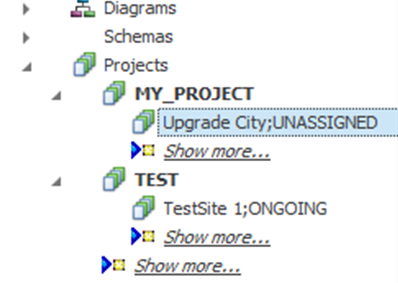
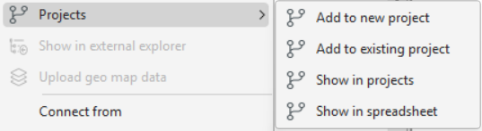
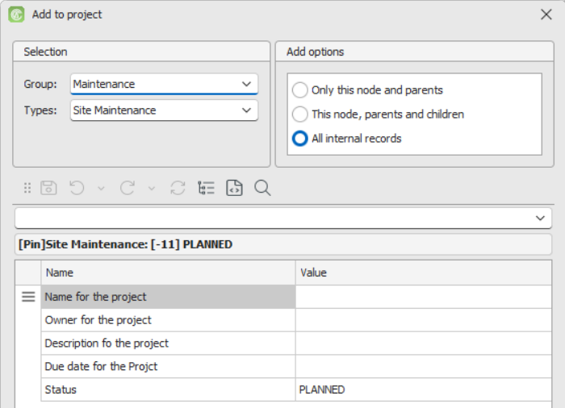
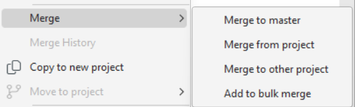
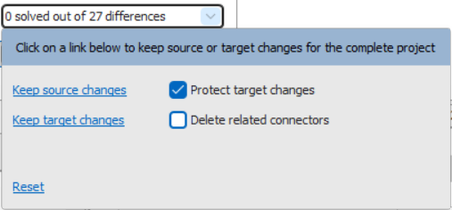
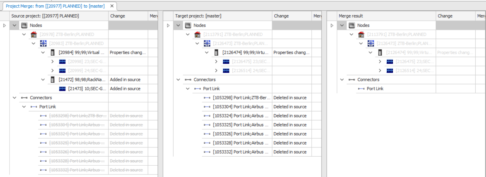
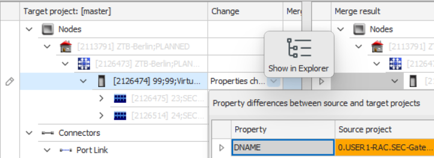
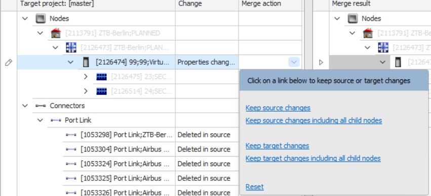

# Projects Workspace

Projects in **Aktavara Console** allow network planners to work with parallel, isolated versions of network data. They function like controlled sandboxes or branches where planners can model changes, test configurations, and coordinate multi-user workflows before merging work back into the master dataset. By creating project copies of network elements, planners can safely explore design variants without affecting production data.

---

## Overview of Projects

Projects:

- Have their own hierarchical structure in **Network Explorer**
- Can include **nodes, connectors, paths**, or combinations of these
- May be derived from:
  - Master inventory or planning schema (maintaining relational ties)
  - Other projects (parent/child/sibling relationships)
  - Newly created objects unique to that project
- Remain independent from other projects unless explicitly related
- Have a unique **project identifier** and project-specific **attributes** (defined in Designer)

### Permissions
Access to projects is governed in **Designer**, where administrators can control:
- Which user groups may view, create, or delete projects
- Which project types are available to specific user groups
- Who may perform merging actions

---

## Creating Projects

### Create a Standalone Project
Used when starting with an empty planning workspace.

1. Open **Projects** in Network Explorer.  
2. Right-click **Projects** → **New** → choose a category.  
   - Or right-click an existing category → **New**.  
3. Fill attributes in the Properties panel.  
4. Click **Save**.

This creates an empty project where you can begin adding objects.

---

### Create a Project Based on a Master Node
Used when a project needs to begin with existing network data.

1. Right-click a master **Node** or **Path**.  
2. Select **Projects** → choose:
   - **Add to new project**, or  
   - **Add to existing Project**  

1. Select the **Group** and Type that the project should be classified in. Based on the **type** that is chosen for the project, only those specific node types can be added to the project

#### Node options
- **Only this node and parents**  
- **This node, parents and children**  
- **All internal records** (default)

#### Path options
- **Only this path** This just copies the path record. Nodes and other paths within the path are only represented as ‘ghost records’ that can be visualised but are not a part of the project. 
- **This path and end nodes**  This copies the path, and the end nodes of the path. All other content of the path is only available as ghost records.
- **This path and all its members** (default) This copies the path and all its content including other paths within the selected path. NB: the content (nodes etc) of these contained paths are not included in the project. 

Objects contained inside sub-paths are not automatically added unless applicable.

---

## Copying Projects

1. Right-click a project → **Copy to new project**.  
2. Console creates a cloned project with a unique identifier.  

Copied projects are treated as **related**, enabling merges:
- Parent → Child  
- Sibling ↔ Sibling  

---

## Modifying Projects

Editing project data works the same way as editing master nodes, connectors, and paths.

### Add Master Objects Into a Project
1. Select top-level master node.  
2. Right-click → **Projects** → **Add to existing project**.  
3. Use **Filter** to find the project.  
4. Click **OK** to import a project-specific copy.

### Add New Objects Within a Project
1. Right-click the project → **New** → choose object type.  
2. Fill attributes → **Save**.

### Delete a Project
1. Right-click project → **Delete**.  
2. Confirm.  
   - All child projects are deleted as well.

---

## Project Merge

Merging is used to consolidate contributions from multiple planners or merge project results back into the master dataset.  
A merge can occur:

- From one project into another  
- From a project back to master  
- From multiple projects using **Bulk Merge**

---

### Initiating a Merge

Right-click the project to merge and choose:

- **Merge to Master**  
- **Merge from Project** (other project becomes source)  
- **Merge to Other Project** (other project becomes target)  
- **Add to Bulk Merge**

  - If added to Bulk Merge:

    - If a workspace is open → project is added  
    - If not → a new workspace is created

    

---

Project Merge Toolbar: Visible during merges

Navigation Controls: Indicate what record-level merge decisions are still unresolved.

### Bulk Merge Decision Dropdown  
This allows global actions:

- **Keep source changes**  

- **Keep target changes**  

- **Protect target changes**

  - This option keeps newer changes in the **target project**, preventing older data from the source from overwriting them.

    Examples:
    - New records in the target stay in place instead of being deleted.
    - Records deleted in the target stay deleted instead of being restored from the source.

- **Show deleted records** (shown with strikethrough)

---

### The Project Merge Screen

The merge screen shows three panels:

| Panel | Purpose |
|--------|---------|
| **Source project** | The project being merged from |
| **Target project** | The project/master receiving changes |
| **Merge result** | The final combined version |

#### Change Review

The **Change** column highlights differences between source and target.  
Selecting **Show all properties** reveals unchanged properties.

#### Merge Actions
For each item, select:

- **Keep source changes**  
- **Keep source + children**  
- **Keep target changes**  
- **Keep target + children**  
- **Reset**  

Selected version is shaded **green**.

#### Finalizing
Click **Save** to perform the merge.  
Refresh the project in Explorer to see updated items.

If no differences exist, Console notifies you.

---

## Merge Rules

Merge rules which are defined in the **Designer** application simplify merges by pre-setting actions.

Two types of rules:

1. **Always use source/target** for certain types or properties  
2. **Ignore specified properties** that should not influence merges  
   - Example: auto-generated timestamps or user IDs

If merge rules are present:
- Most decisions appear pre-filled
- User only resolves remaining conflicts

---

## Bulk Project Merge

Bulk Merge automates merging a sequence of projects without user interaction.  
This requires:
- Merge rules defined for *all* involved types

---

### Adding Projects to Bulk Merge

#### From Explorer
Right-click → **Merge > Add to bulk merge**

#### From Bulk Merge Workspace
1. Click **Search for projects**  
2. Search for **Project Nodes**  
3. Use containment conditions (e.g., *Child of*) if needed  
4. Matching projects are added to the queue

---

### Bulk Merge Workspace

The workspace displays queued projects in a spreadsheet-like list.

Multiple bulk merge workspaces can be active to group merges independently.

#### Toolbar Actions
- **Search for projects**  
- **Remove Selected / Remove All**  
- **Merge Selected / Merge All**  
- **Stop Selected / Stop All**

#### Merge Status Values
- **Waiting to be merged**  
- **Merge in progress**  
- **Completed**  
- **Cancelled**  
- **No differences found**  
- **Merge not complete** (unresolved differences)

---

## Searching Within Projects

Show All Projects Related to a Master Node

* Right-click a master node → **Projects > Show in projects**

View Projects in Spreadsheet

* Right-click master node → **Projects > Show in spreadsheet**

From Spreadsheet, jump to Project in Explorer

* Select a row → hover → **Show in Explorer**

Find Master Element From a Project Element

* Right-click project element → **Show in Explorer**

### **Search Portal**

1. Open **Search**  
2. Select **Record Kind**: Project node, project path, or project connector  
3. Choose type  
4. Use direct search or containment search  
5. Execute (**Alt+E**)  
6. In results: hover → **Show in Explorer**

## Merge History

Merge history allows users to view any merge actions that have been performed on a project. 

1. On the context menu of the project you want to see the history for, select **merge history**

In the popup, you are shown all the previous merge actions. 

To review the merge that was performed, click the DATE field and it will open the project merge from a **Source** perspective. the merge decisions from the source will be presented. 

**NB:** Any merge decisions where the **target**  was the selected merge decision won't be shown in this overview since this decision inherently did not make any changes to the target dataset. 

