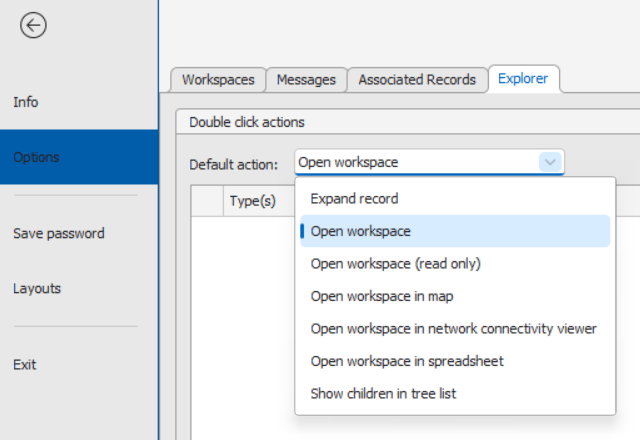

# Quick Start Guide 

This guide provides a streamlined overview for new users of **Aktavara Console**, including how to connect, navigate the interface, perform searches, and use key operational tools such as Consistency Checks, Capacity Change, and Upgrade/Downgrade.

---

## Connecting to Aktavara Console

1. Open **Internet Explorer** and enter the URL:  
   `http://<your-aktavara-server>/akta.WS/deploy/console/publish.htm`  
   Example (local server):  
   `http://localhost/akta.WS/deploy/console/publish.htm`
2. Press **ENTER**.
3. When prompted, click **Run**.
4. If this is your first login or the client was updated, it will auto‑download and install.
5. Enter your **username** and **password**, then click **OK**.

---

## Main Window Overview

### Quick Access Toolbar
Always visible. Contains essential commands such as Save, Undo, Redo, Refresh, Properties, Show in Tree, etc.

### Ribbon Tabs
- Click any tab to display its commands.
- The **Main** tab contains the most frequently used actions.
- Workspace commands appear when relevant.

### Info Sheet
Access help, version information, user options, and layout configurations.

### Panel Toolbars
Panels (e.g., Properties) include their own toolbar actions such as Refresh.

### Zoom Controls
Adjust zoom using the slider in workspace environments.

### Mini Toolbar
Appears when hovering over or right‑clicking a selected record.  
Shows commands based on workspace and object type.

---

## Connected Records in Explorer

Nodes automatically show connections beneath them:
- Connectors  
- Carriers  
- Paths  
- Topologies  

Connectivity is grouped by type kind and expands hierarchically.

---

## Searching in Aktavara Console

### Instant Search
Found at the top of the user interface for quick lookups.

### Full Search Workspace
Open via **Main Ribbon** → Search or **Ctrl+F**.

- Appears as a dedicated tab.
- Multiple result types can be added.
- Execute with **Alt+E** or **Shift+Enter**.
- Saves history of commonly searched attributes per type.

### Search All
Use **Search <Type>** or **Ctrl+F, Ctrl+T** to immediately begin with a preselected type.

### Multiple Conditions
You may:
- Filter across several types individually  
- Add conditions applying to *all* selected types  

### Spreadsheet Filtering
Filtering now acts immediately without loading all records.

- Enter text in the filter row and press Enter.
- Remove filter using Delete or **Remove Filter**.
- Use **ALT+E** / **Shift+Enter** to retrieve all data if needed.
- Use **Find Panel** to highlight matches within results.

---

## Consistency Checks

Consistency Checks are based on Record or Custom Searches.

Capabilities:
- Run checks on one or several selected records.
- Choose specific checks to execute.
- Output results as one combined spreadsheet or one per check.
- Save outputs as individual files.

Access from type‑specific context menus.

---

## Capacity Change

Used to manage capacity and SFP changes on ports and paths.

### Capacity Change on Paths
Workflow:
1. Select path/port to change  
2. Select new endpoint types  
3. Adapt path structure  
4. Update tag structure & allocations  
5. Review affected records in a spreadsheet  

Supports tag hierarchy comparison and drag‑and‑drop allocation.

### Capacity Change on Ports
Two cases:

#### Port is endpoint of configured path type  
Acts like a full path change.

#### Port is not endpoint  
Performs a single‑port-only change.

### Designer‑Defined Rules
Rules specify:
- Which ports can be changed  
- Attribute mapping behavior  
- Selection criteria  

---

## Upgrade / Downgrade

Enables updating or swapping network elements based on **resource templates**.

### Features
- Updates attributes  
- Adds/deletes child records  
- Maps connectivity  
- Enforces type‑compatible mapping  
- Guided by Designer expressions  

### Workflow
1. Right‑click object → **Upgrade/Downgrade**  
2. Select a template  
3. Adjust mapping via drag‑drop  
4. Set actions on unmapped nodes  
5. Save  
6. Spreadsheet shows affected records  

If deletion targets contain connectivity, function aborts and displays dependencies.

---

## Pan and Zoom

Used in Graphics, Path, and Diagram workspaces:

- Drag marker to pan  
- Use slider to zoom  

---

## Smart Tags

Appear when selecting multiple objects.  
Hover to view relevant actions.

---

## Personalising the Aktavara Console

### Display Themes

Settings available on the **Info Sheet**:

- **Light (default)**  
- **Dark (high contrast)**  

### Tabs vs. Floating Windows

Use **TabbedMDI** to toggle between tabbed and floating layouts.

### Moving & Docking Windows

Drag windows to reposition or snap using docking guides.  
Use **unpin** to auto‑hide panels and maximize workspace visibility.

### Layout Persistence

Layouts store:
- Docking states  
- Visibility  
- Panel positions  

Manage layouts via **Info Sheet → Layouts**.

### Configure Double‑Click Behavior

The **Double‑Click Configuration** in Aktavara Console lets you define what happens when you double‑click items in the **Network Explorer**.  
By default, double‑click opens the appropriate workspace (e.g., Graphics for nodes, Path for paths), but this behavior can be customized per object type.

#### Accessing the Settings

1. Open **Settings** in the **Console**.  
2. Select the **Explorer** tab.  

1. In the spreadsheet on this tab, you can **Add**, **Modify**, or **Remove** entries defining double‑click actions for one or more Aktavara objects.

#### Available Double‑Click Actions

| Action                                            | Description                                                  |
| ------------------------------------------------- | ------------------------------------------------------------ |
| **Execute Custom Search**                         | Runs a predefined **Custom Search**. Specify search conditions and the entity where it should execute. |
| **Execute Record Search**                         | Runs a **Record Search** using specified criteria within the chosen entity. |
| **Execute Resource Template**                     | Executes a predefined **Resource Template** specified in the *Entity* field. |
| **Open Workspace**                                | Default action — opens the appropriate workspace for the selected record type (e.g., Graphics for nodes, Path Workspace for paths, Topology, Carrier, or Diagram). |
| **Open Workspace in Map**                         | Opens the selected item in the **Map Workspace** view.       |
| **Open Workspace in Spreadsheet**                 | Displays the selected item’s contents in a **Spreadsheet view** (e.g., node details or path composition). |
| **Open Workspace In Network Connectivity Viewer** | This can be a default alternative for Paths, Topologies and Diagrams. |
| **Show children in tree list**                    | Specifically used for IPAM module, applicable when double clicking on IP address node types |

---

✅ **Tip:** Use this configuration to streamline navigation—assign context‑specific double‑click actions to different record types for faster access to the most relevant workspace.

