# Route Exchanger

The **Route Exchanger** tool (found under the **Tools** tab in the Ribbon) enables network planners to modify existing paths or connections. It supports:

- Exchange Sections
- Bulk Record Handling – Remove Intermediate Ends
- Bulk Record Handling – Add Intermediate Ends
- Bulk Record Handling – Card Swap

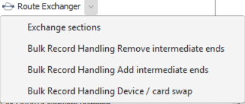

---

## 1. Exchange Sections

### Purpose
Use the **Exchange Sections** feature to replace a path segment or node with another, automatically identifying all dependent paths or topologies affected by the change.  
This feature is ideal for single-section exchanges shared by multiple paths or topologies — not for complex multi-exchanges (use Bulk Record Handling instead).

### Process Overview
The wizard guides users through:
1. **Defining** the segment or node to disconnect.  
2. **Selecting** the new connection to replace it.  
3. **Resolving conflicts** with dependent paths or topologies.  
4. **Saving** the exchange once all conflicts are addressed.

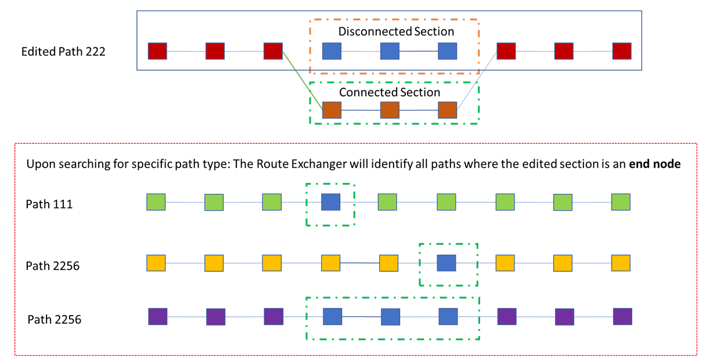

### Steps

#### 1. Start the Exchange
- Open the **Route Exchanger workspace**.  
  - ⚠️ The workspace must be open before right-click context menus will show the Route Exchanger options.
- Select **Exchange Sections** from the dropdown to open a new workspace tab.

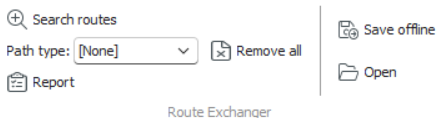

#### 2. Define the Section to Disconnect
- From a **Path or Topology workspace**:  
  - Select nodes forming the segment → right-click → **Route Exchanger → To be disconnected**.  
  - Or drag the selection directly into the Route Exchanger workspace.  
- From the **Network Explorer**:  
  
  - Drag and drop the desired path, topology, or node into the workspace.
  
  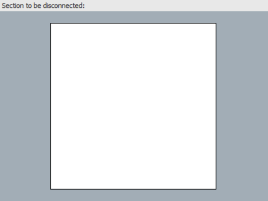

#### 3. Define the Section to Connect
Repeat Step 2, by either using 

* Context menus in the Path or Topology workspace, or from the Network Explorer

* Drag‑and‑drop to add the section that should be connected.  

  Common path workspace options like bridge or end node searches are available.

#### 4. Search for Routes
- Select the desired **Path Type** in the toolbar.  

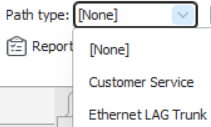

- Click **Search Routes** → choose the preferred routes in the spreadsheet results dialog → click **OK**.

 

#### 5. Resolve and Save
- If **no dependencies** exist: status shows *Routes can be exchanged* → click **Save** in the Ribbon.  

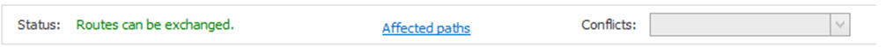

- If **conflicts** exist:  
  - Status shows *There are conflicts to be resolved.*  
  
  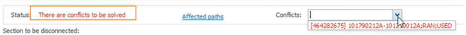
  
  - Resolve each conflict via dropdown → complete all exchanges → return to the main tab.  
  - When all conflicts show *Conflict resolved*, click **Save** in the MAIN ribbon bar again.

---

## 2. Bulk Record Handling

### Configuration Notes
To use Bulk Record Handling features, ensure the designer is configured to allow:
- Drag‑and‑drop of supported record types.  
- Exchange actions at the appropriate level (e.g., Port).  
If drag‑and‑drop isn't available, contact your **Aktavara Administrator**.

---

### 2.1 Remove Intermediate Ends

#### Purpose
Removes intermediate nodes between two end nodes, connecting the outer nodes directly.  
Best for large‑scale exchanges across many paths or nodes.

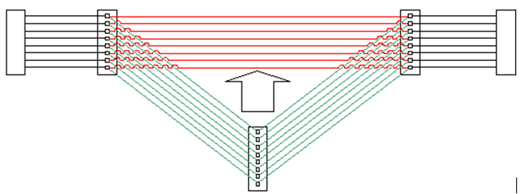

#### Input
1. Start **Route Exchanger → Remove Intermediate Ends**.  
2. Drag and drop node records into panels (or start from a record context menu).  
3. Complete two mapping steps:  
   - Start → Intermediate nodes  
   - Intermediate → End nodes

#### Mapping
- Map single node pairs (Ends1 → Ends2).  
- Only end nodes of the same type can be mapped.  
- Review mappings in the **Ends Mapping** pane.  

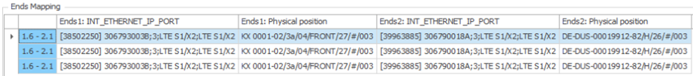

- Use the hyperlinks links to view **Affected Connections** or **Removed Connections** reports.

#### Execution
1. Click **OK** to perform the exchange:  
   - Exchanges ends per mapping.  
   - Removes obsolete connections.  
2. The system confirms completion and opens an affected connectivity spreadsheet.  
3. Click **Save** in the Ribbon to finalize.

---

### 2.2 Add Intermediate Ends

#### Purpose
The inverse of “Remove Intermediate Ends” — inserts new intermediate nodes between two ends.  
Useful for batch updates involving multiple nodes.

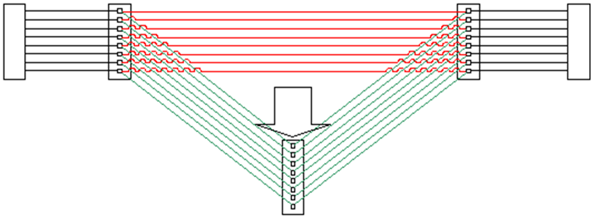

#### Input & Mapping
Same steps as “Remove Intermediate Ends”: 

1. Define node pairs and map Ends1 → Ends2.  Only nodes of the same type can be mapped.

The **Affected Connections** hyperlink opens a Spreadsheet containing all connections and paths whose ends are going to be exchanged. 

#### Execution
- Existing connectors are updated and new connectors created as per mapping.  
- System displays confirmation and opens the affected connectivity spreadsheet.  
- Click **Save** to finalize.

---

### 2.3 Card Swap

#### Purpose
Replaces an old card with a new one while maintaining mapped connections and structure automatically:
- Swaps connectivity for mapped ports.
- Moves unmapped child nodes to the new card or equivalent port.

#### Steps
1. Open **Route Exchanger workspace → Card Swap**.  
2. Drag old card to the **left panel**, new card to the **right panel**.  

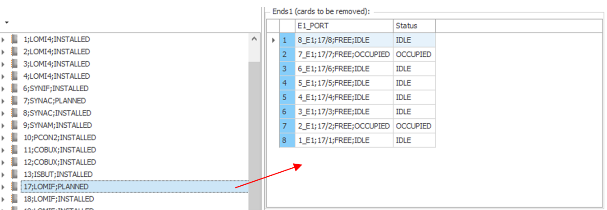  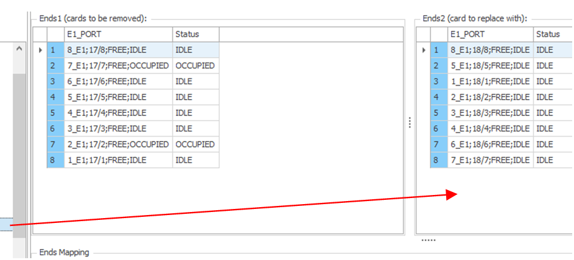

1. Sort columns (e.g., *Type*) in both panels for consistent mapping.  
2. Select ports in both panels → choose **Ends Mapping on Selection** (for all) or **Map to Select Ends** (for one).  
3. Review mappings in the bottom panel → click **OK** to execute.  

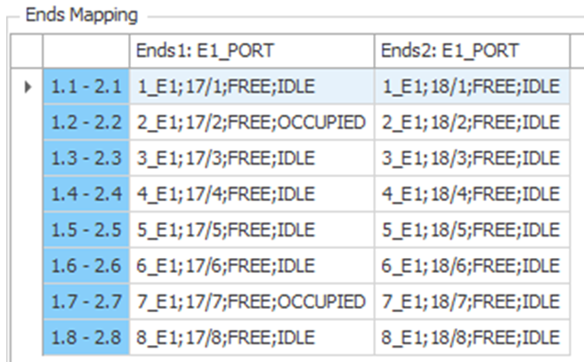

1. A confirmation dialog and list of swapped connectivity appear.  
2. If an error occurs, review the Message in the messages window.

---

✅ **Tip:** Always save exchanges from the **main Ribbon bar** after successful operations.
