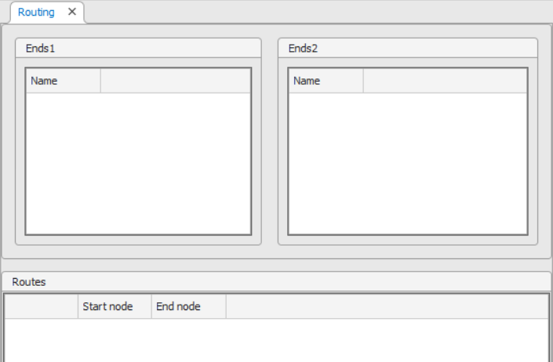
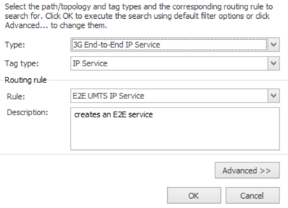

# Routing Workspace

The **Routing workspace** in Aktavara Console is used to discover routes between two network nodes by analyzing existing connections and paths. It provides tools to define endpoints, configure route generation rules, evaluate multiple possible routes, and save selected routes as new paths. 

---

## Opening the Routing Workspace
1. Start **Aktavara Console**.  
2. Navigate to **Tools > Routing**.  
3. The Routing workspace opens with:  
   - **Ends1 panel** – starting nodes  
   - **Ends2 panel** – ending nodes  
   - **Routes panel** – route definitions and search results  
   
   

---

## Adding Nodes to the Routing Workspace

Adding nodes defines the endpoints for route discovery.

### Add Nodes
**Method 1 – Context Menu (recommended):**
1. In **Explorer**, expand **Nodes**.  
2. Right‑click a node → **Routing** → choose **Add to Ends1** or **Add to Ends2**.

**Method 2 – Drag & Drop:**  
Drag nodes from Explorer into either panel.

### Remove Nodes
Use the workspace toolbar:
- **Remove Ends → Saved / Unsaved / All**  
- **Remove All** – clears both panels

After adding the nodes, define how they pair to form route searches.

---

## Defining Connections / Routes

Route definitions tell the system which node pairs to evaluate.

### Add Route Definitions
From the toolbar:
- **Add Linear** – automatically pairs nodes in index order (1→1, 2→2…)  
- **Add on Selection** – pairs only selected nodes  

From right‑click menus in Ends1/Ends2:
- **Add routes on linear selection**  
- **Add on selection**  
- **Add routes to all Ends2** / **Add routes to selected Ends2**  
  (and vice‑versa)

### Remove Routes
- **Remove Routes → Saved / Unsaved / All**  
- Or right‑click a route → **Remove**

Now you’re ready to run the search.

---

## Searching for Routes

1. Select a row in the **Routes panel**.  
2. Click **Search Routes** on the toolbar.  
3. The **Routing Options** dialog appears.

### Routing Options Overview

Configure:

- **Path type**  
- **Tag type**  
- **Routing rule**  
- **Description**

Click **Advanced** to access:
- Retrieve first *n* shortest routes  
- Maximum allowed intermediate elements  
- Search depth  
- Free‑capacity only  
- Step‑by‑step execution  
- Routing hints  

Click **OK** to run the search.

### Results
- Progress is displayed in the **Progress window**.  
- Found routes appear in a spreadsheet view showing nodes and connectors/paths per route.

---

## Saving Routes as Paths

After route discovery, you can create actual path records.

### 1. Select routes
Check the box next to one or more discovered routes.  
Click **Save** on the main toolbar.

### 2. Route Completion Wizard
The wizard:
- Auto‑fills known values  
- Prompts you only for unresolved details  
- May not appear if all values are determined automatically  

Enable **Create parallel path** if desired.

### 3. Choose Components
Depending on route complexity:
- Select which connector/path entries to use  
- Ctrl‑click multiple items for parallel paths

### 4. Tag Assignment
Options may include:
- **No assignment**  
- **Expand/Collapse unassigned tags**  
- **Assign only on identical tag types**

### 5. Creating Missing Connectors
Wizard may prompt you to:
- Add **virtual connectors**, or  
- Create new connector types manually  

### 6. Set Connector Properties
Click the **…** button if prompted to configure the new connector’s properties.

### 7. Finalize
Choose post‑creation action:
- **Workspace** – open in Path workspace  
- **Spreadsheet** – list affected records  
- **None** – silent creation  

Click **Finish**.
