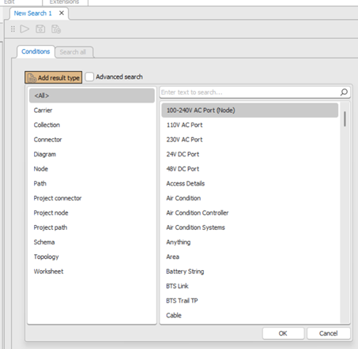
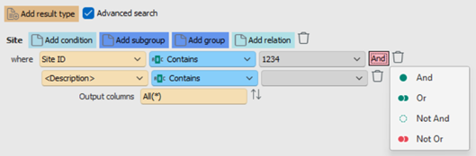
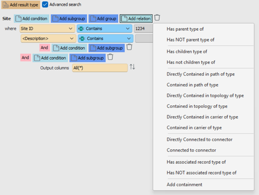
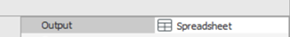
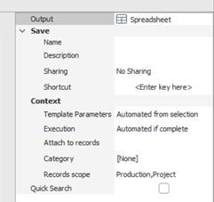
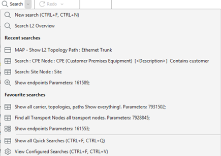

# Search Interface & Advanced Search

This guide describes how to create, manage, and execute record searches using the **Search Interface**, **Search Workspace**, and **Advanced Search** features. It integrates both conceptual understanding and practical procedures to help users effectively query and navigate records in Aktavara Console.

---

## Access & Navigation

- **Location:** The primary Search is available from the **main ribbon** under the **Search** menu.  

 

- **Keyboard Shortcuts:**  
  - `Ctrl + F, Ctrl + N` → Create a new search.  
  - `Ctrl + F, Ctrl + O` → Open the search menu.  
  - `Ctrl + F, Ctrl + V` → View existing saved searches.  
  - `Ctrl + F, Ctrl + T` → Search by the selected record type.

### Opening the Search Interface
You can start a new search in several ways:

1. Press `Ctrl + F`, then `Ctrl + N` or select **Search → New**.  
2. Click the **Search** button in the main ribbon.  
3. From **Network Explorer**, right-click a record (e.g., *Site*, *Transport Node*), and choose **Search by Type** to open a search pre-scoped to that type.

> 💡 **Tip:** When starting from a selected record, the system automatically highlights the most frequently used attribute for that type (e.g., *Service Type*).

---

## Search Workspace (Standard Mode)

The **Record Search** workspace allows you to define conditions, select output preferences, and execute or save searches.  

When opened, the dialog defaults to **<Add Result Type>**, where you select the data type to search (e.g., *Site*, *Path*, *Topology*, *Node*).

### Adding Types and Conditions

- Use **<Add Result Type>** to include one or more record types.  

- Add conditions for each type. The interface automatically builds a logical query structure as you define them.  

- Properties (columns) are type-specific — e.g., *Site ID*, *Object ID*, *Status*, *Description*.  

   

#### Condition Operators
Operators vary by data type:  
- **Text:** equals, does not equal, contains, begins with, etc.  
- **Date:** before, after, between (includes date picker).  
- **List/Enum:** dropdown of allowed values.

Use the **trash can** icon to remove conditions or the **AND/OR/NOT** toggles to change logical relationships.

> ⚠️ **Note:** The default condition is usually *Description contains [blank]*, which returns all records.

---

## Specifying Complex Conditions

### Grouping and Subgrouping
Use **Advanced Search** to group conditions logically.  
- **Groups** combine related conditions.  
- **Subgroups** nest logic for finer control of query precedence.

Example:  
> (Status = Active AND Type = Site) OR (Region = "North")

### Relation Conditions
Relation conditions allow searching by hierarchical or connectivity relationships, such as:
- **Parent/Child**: has parent or child of a specified type.  
- **Containment**: contained within *Path*, *Topology*, or *Carrier*.  
- **Connectivity**: connected to a specific *Connector*.  
- **Containment Drag & Drop**: drag a record (e.g., Site or Node) into the condition area to set it as the container.

Examples:  
- *Has Parent Type of “Region”* → Finds all Sites under a Region.  
- *Contained in Path of Type “Ethernet Trunk”* → Finds all Transport Nodes within those paths.

 

> 💡 **Tip:** Advanced relation-based queries can be resource-intensive. Use them selectively for targeted analysis.

---

## Output, Sorting & Display

### Output Options
Search results can appear in multiple workspaces:   
- **Spreadsheet (default)** — tabular record display.  
- **Explorer** — opens results as a hierarchy view.  
- **Map** — where geographic visualization is enabled.

### Customizing Columns
- Use the **column selector** to add or remove displayed attributes.  
- Drag and reorder columns to adjust display order.  
- Sorting is available per column or globally via the toolbar.

---

## Executing Searches

Once conditions are defined, click **Execute** (▶ icon) on the toolbar or press `Alt + E` / `Shift + Enter`.  
Results display in the configured workspace.

- **Progress Window:** Appears during query execution, showing retrieval status.  
- **Contextual Searches:** From *Explorer*, right-click an item → *Search → [Category]* to run pinned or attached searches.

> 💡 **Tip:** If a saved search includes execution parameters, the **Execute Search** window prompts for those values before running.

---

## Saving, Templates & Sharing

### Saving a Search
After defining conditions and options:
1. Click **Save** on the toolbar.  
2. Name your search and add a **Description**.  
3. Select **Sharing Options**:  
   - *No sharing* — private.  
   - *Share within group(s)* — choose one or more sharing groups.  
   - *Share with all groups* — global access.

You can also assign a **shortcut key** (e.g., `Ctrl + F, G`) for quick execution.

### Saving a Template
- Templates save the **search structure** but not values.  
- Use templates for reusable queries where values change frequently.  
- Execute a template to input parameters manually at runtime.

> ⚠️ **Note:** Templates are automatically saved when no parameter values are defined.

### Attaching & Pinning Searches
Searches can be:  
- **Attached** to record types (e.g., *Node*, *Path*).  
- **Pinned** to menus:  
  - *Search Menu* → accessible via right-click in Explorer.  
  - *Record Search Window* → available when viewing searches.

---

## Quick Searches & Favourites

### Quick Searches
Quick Searches are saved filters available directly in the search dropdown.  

To mark a search as a **Quick Search**, enable the checkbox during save.  
It will appear under **Quick Searches** in the ribbon menu.  

 

### Favourite Searches
Favourite (starred) searches appear at the top of the Quick Searches list.  

### Executing Quick Searches
1. Press `Ctrl + F`, then `Ctrl + O` → open the search menu.  
2. Navigate to **Quick Searches**.  
3. Double-click a quick search to execute.  
4. If parameters are required, fill them in the execution dialog.

---

## Editing & Managing Searches

### Edit a Search
1. Press `Ctrl + F`, then `Ctrl + V` → View saved searches.  
2. Right-click a search and select **Open**.  
3. Modify type, conditions, or options.  
4. Click **Save** or **Execute**.

### Delete a Search
1. View saved searches (`Ctrl + F`, `Ctrl + V`).  
2. Right-click the search → **Delete**.  
3. Confirm deletion.

---

## Advanced Search Examples

| Use Case | Example Condition |
|-----------|-------------------|
| Find all Transport Nodes in a Path | Contained in Path Type = “Ethernet Trunk” |
| Identify Sites in a Region | Has Parent Type = “Region” |
| Locate Connectors of a Specific Type | Connected to Connector Type = “Fiber Cable” |
| Retrieve all Paths using a Connector | Contained in Connector Type = “Connection Cable” |

---

## Best Practices

- Combine conditions thoughtfully to avoid unnecessary load.  
- Save frequently used searches as **Quick Searches** or **Templates**.  
- Use **Groups** and **Relations** for complex data models.  
- Limit **output columns** to essential attributes for clarity and performance.

> 💡 **Tip:** Always review your **Result Type** and **Output Workspace** before executing large searches to ensure optimal results.

---

