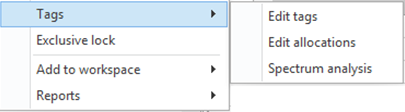
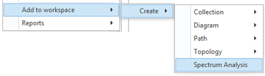
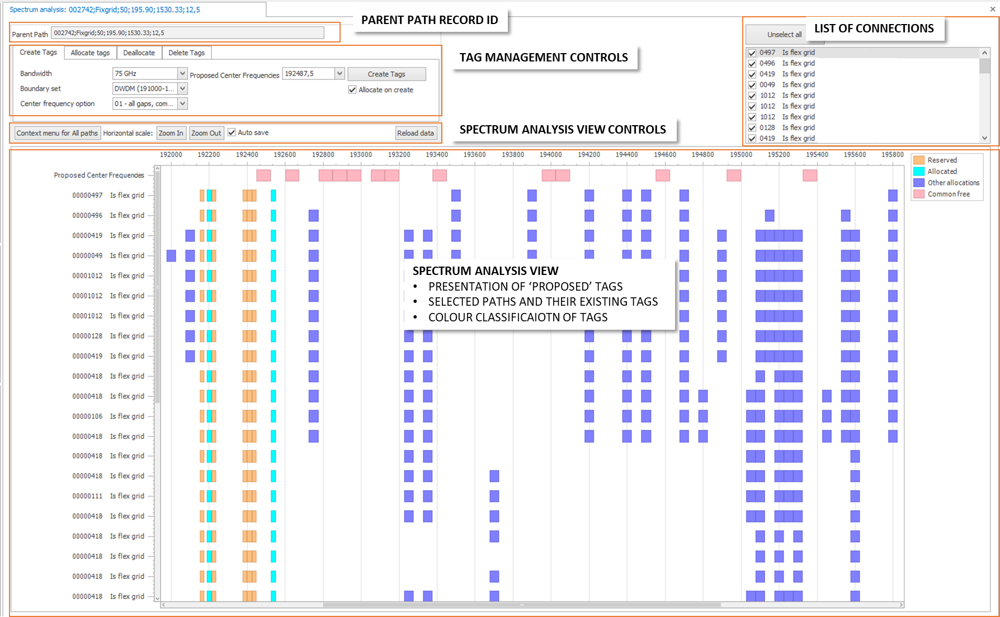
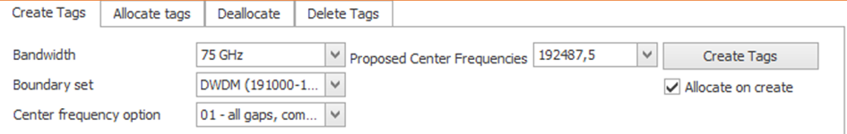
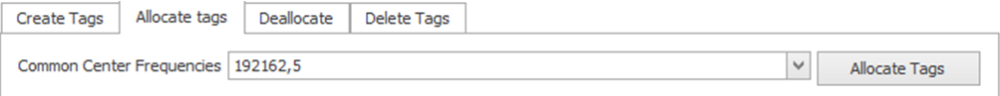
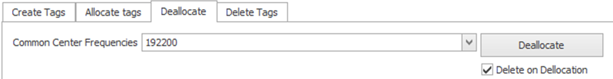
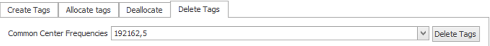
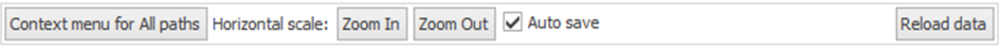

# Spectrum Analysis

**FlexGrid** is an advanced WDM (Wavelength Division Multiplexing) technology that enables flexible spectrum usage and higher efficiency in optical transmission networks.  
The **Spectrum Analysis Workspace** visualizes these resources, helping operators identify available, reserved, and allocated spectrum slots. This workspace is designed for use with **Enhanced Tags**, which extend standard tagging functionality by including additional properties (see Designer Module HELP ***Tags with Properties – Enhanced Tags***).

---

## Opening the Spectrum Analysis Workspace

The workspace can be opened in multiple ways depending on the user’s workflow and source context.

### From Tags
1. In the **Network Explorer**, select a path that uses an **Enhanced Tag** configured for Spectrum Analysis.  
2. Open the context menu.  
3. Select **Tags → Spectrum Analysis**.  

> ⚠️ **Note:** If the Spectrum Analysis Workspace is already open, the menu option will be hidden.

### Add to Workspace
1. In the **Network Explorer**, select a path with an Enhanced Tag configured for Spectrum Analysis.  
2. Open the context menu.  
3. Choose **Add to Workspace → Create → Spectrum Analysis**.  

> ⚠️ **Note:** Ensure the workspace is not already open, or this menu option will not appear.

---

## Navigating and Understanding the Spectrum Analysis Workspace

The Spectrum Analysis Workspace is divided into several sections, each providing different functionality and information related to tag management and visualization.

### Parent Path Record
If the workspace is opened from a *Parent Path*, this section displays it. Additional functions become available for managing tags linked from child to parent paths:
- Only child paths related to this parent are shown.  
- Features for **allocating** and **deallocating** tags to and from the parent are enabled.

### List of Connections
All path records with tags configured for **FlexGrid** appear in this section.  
If a path has a *ticket box*, it will also appear in the Spectrum Analysis View, giving a consolidated view of related records.

### Tag Management Controls
Tag management functions are grouped into separate tabs, each representing a specific use case.  
When using these functions, only the **loaded path records** in the Spectrum Analysis View are affected — deselected records are ignored.

---

## Tag Management Functions

### Create Tags
This function allows users to create new tags across all paths loaded into the Spectrum Analysis View.

1. Select the **bandwidth** from the dropdown that corresponds to the resource size you want to tag.  
2. Use the **Boundary Set** control to adjust the horizontal frequency scale to fit the minimum and maximum spectrum values.  
3. (Optional) Select the **Center Frequency** option to apply a specific algorithm for tag positioning.  
4. After steps 1–3, the **Proposed Center Frequencies** are displayed both on the view and in the dropdown list.  
5. Choose the desired frequency value to create the tag.  
6. (Optional) Check **Allocate on Create** to immediately assign the new tag to the parent path (if applicable).  
7. Click **Create Tags**.  
8. Once complete, the workspace refreshes and the new tags appear as *Reserved* or *Allocated*.

---

### Allocate Tags
This function allows the user to allocate existing tags to a parent path.

1. Select the desired **center frequency tag** from the *Common Center Frequencies* dropdown (only tags shared by all loaded connections are displayed).  
2. Click **Allocate Tags**.  

The selected tag is now linked to the parent path and marked as allocated in the view.

---

### Deallocate Tags
This function enables deallocation of tags from the parent path.

1. Select the **center frequency tag** to deallocate from the *Common Center Frequencies* dropdown.  
2. (Optional) Check **Delete on Deallocation** if you want the tag to be removed after deallocation.  
3. Click **Deallocate**.  

The tag is removed from the parent allocation and optionally deleted if the option was enabled.

---

### Delete Tags
This function removes tags that are common to all loaded connections.

1. Select the **center frequency tag** from the *Common Center Frequencies* dropdown.  
2. Click **Delete Tags**.  

The selected tag is deleted, and the view refreshes to show the updated spectrum allocation.

 

---

## Spectrum Analysis View

The **Spectrum Analysis View** visually represents tag placement and spectrum utilization across all loaded paths.  
It provides color-coded visual cues for allocated, reserved, and free resources, allowing users to quickly assess spectrum availability and conflicts.

### Mouse Interaction and Controls

- **Scroll Wheel:** Zoom in and out of the spectrum view. Zooming in helps when multiple connections overlap or tags are closely spaced.  
- **Left Click + Drag:** Pan across the canvas to reposition the view, similar to moving a map. Vertical and horizontal scrollbars can also be used.  
- **Right Click on a Tag:** Opens the **context menu**, allowing tag-related actions on the selected connection.  
- **Left Click on a Tag:** Updates the **Properties Panel** with details about the selected connection.  
- **Hover Tooltip:** Displays contextual information for the tag under the cursor (e.g., frequency, bandwidth, allocation status).  

---

## Spectrum Analysis Toolbar

The toolbar provides quick access to workspace controls and data management functions:

- **Context Menu for All Paths:** Access to general tag management operations.  
- **Zoom In / Zoom Out Buttons:** Adjust spectrum scale visually.  
- **Auto Save:** When enabled, the system automatically commits changes after each tag management action (Create, Allocate, Deallocate, Delete).  
  This ensures that data stays synchronized and consistent across operations.  
- **Reload Data:** Refreshes the workspace if tags or configurations have changed elsewhere in the system (for example, after tag edits in the traditional Tag dialog).  

 