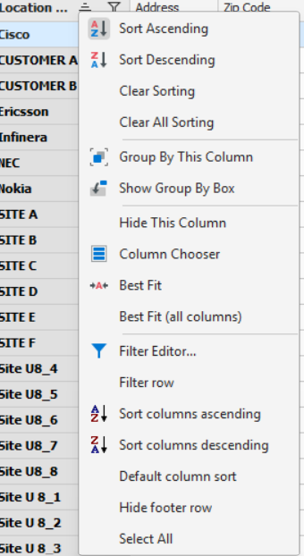
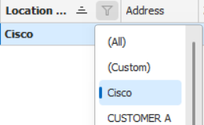
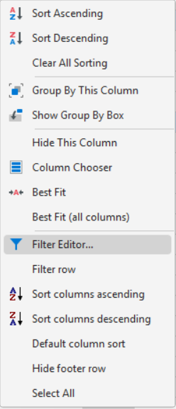
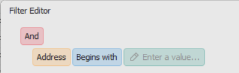
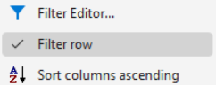
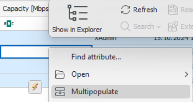
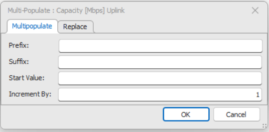

# Spreadsheet Workspace

The **Spreadsheet Workspace** provides a flexible, tabular interface for viewing and managing multiple records simultaneously. It supports data entry, editing, filtering, and organization in a familiar grid-style layout, allowing users to work efficiently with large datasets across one or more record types.

---

## Overview

The Spreadsheet Workspace displays records returned from a search or query in a grid format. It allows inline editing of multiple records at once, with **record-by-record saving** — ensuring that even if one record fails validation, others are successfully committed to the database.

Depending on the search used, the spreadsheet can display **records from one or multiple record types** (e.g., Sites and Regions). When a dataset exceeds 100 records, **automatic paging** is enabled. Additional records are loaded seamlessly as the user scrolls or navigates through the grid, and the status bar reflects the total number of retrieved records. Users can press **Ctrl+End** or click **More** to load all remaining records.

The workspace content can be refreshed at any time using the **mini toolbar’s Refresh** option. In addition to general data management, the Spreadsheet Workspace can be used for tasks such as **connecting network nodes** or creating records from **resource templates**.

---

## Layout and Customization

Users can personalize the Spreadsheet Workspace layout to suit their workflow, including column arrangement, sizing, sorting, and visibility. These preferences can be saved automatically or upon confirmation, based on the **Save Grid Layout** option in *Tools → Options → Spreadsheet*.

### Column Management
- **Rearranging:** Drag and drop column headers to change their order.  
- **Resizing:** Drag the column borders manually, double-click to auto-fit, or right-click for “Best Fit” and “Best Fit (All Columns)”.  
- **Selecting Columns:** Use **Column Chooser** to show or hide columns. Columns can be re-added by dragging them from the customization box back to the grid header.  

### Sorting and Grouping
- Click a column header to **sort** ascending or descending.  
- Right-click and choose **Group by This Column** to organize data hierarchically. The **Group By Box** can be shown to drag multiple columns for nested grouping.  
- Sort and grouping preferences are restored automatically when reopening the spreadsheet (depending on layout options).

---

## Filtering and Data Refinement

The Spreadsheet Workspace supports multiple filtering methods to refine search results beyond the initial query.

### AutoFilter
- Quickly narrow records by selecting values, blanks/non-blanks, or defining custom criteria directly from a column's dropdown.     
- Logical conditions can use operators such as *equals*, *greater than*, *like*, *contains*, etc.

### Filter Builder
- The **Filter Editor** offers a more advanced interface to build complex conditions using AND/OR logic.  
- Users can compare values across columns, define ranges (e.g., *between*), or use text-based operators (*contains*, *begins with*, etc.).  
- Filters can be saved, modified, or cleared easily from the context menu.

     

### Filter Row
- Activate the **Filter Row** to type filter criteria directly beneath the column headers.  

  

- The spreadsheet updates instantly without retrieving all records again.  

- Filters remain applied even when the filter row is hidden.

---

## Multipopulate

The **Multipopulate** feature enables users to quickly fill a selected column with a **series or pattern of values** across multiple records. 

Depending on the field type, users can define prefixes, suffixes, start values, and increments.  
For example, a numeric column might generate values like *Node_001*, *Node_002*, *Node_003*, and so on.  
This is particularly useful for batch creation or sequential naming. Users can also fill a single common value across all selected records by entering only a prefix or value.

 

---

## Record Management

Records can be deleted in bulk by selecting multiple rows and choosing **Delete** from the context menu or Smart Tag. 

A confirmation prompt ensures deliberate action, and deleted records are visually struck through until saved.  
All changes (additions, deletions, edits) must be finalized using the **Save** command on the main toolbar.

---

## Resource Templates

The Spreadsheet Workspace supports **Resource Templates** created in the Designer module. Templates define reusable record structures with prefilled attributes, simplifying the creation of new entities such as nodes or network components.

From the mini toolbar, users can select **New from Template**, browse template categories, and instantiate new records directly within the spreadsheet.

