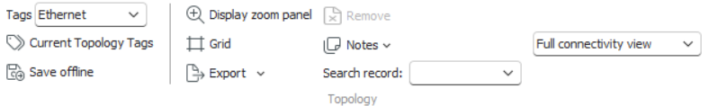
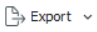
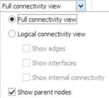

# Topology Workspace

The **Topology Workspace** is a graphical editor used to view, design, and modify network topology records. It provides a visual representation of nodes, connectors, paths, and contained topologies, allowing users to manage complex network relationships efficiently.

By default, a topology record is displayed with **nodes** represented as rectangles, **connectors and paths** as L-shaped lines, and **contained topologies** as clouds. Users can zoom and pan to explore or edit various network segments.

---

## Starting the Topology Workspace

To open the Topology Workspace:

2. In the **Network Explorer Workspace**, expand **Topologies**, and navigate to the topology type you wish to view or edit.  
3. Double-click the desired topology to open it in the **Topology Workspace**.

Once opened, the workspace displays the topology diagram, ready for editing or analysis.

---

## Adding and Removing Content

The Topology Workspace allows users to insert, edit, and remove various elements — such as **notes**, **nodes**, **connectors**, **paths**, and **sub-topologies** — directly within the graphical view.

### Adding and Managing Notes

- **Add a Note:** Right-click an empty area and choose **Add Note** from the context menu. A note appears on the canvas. Double-click it to edit the content, then click **Save** from the toolbar.  
- **Hide or Show Notes:** Right-click anywhere in the workspace and choose **Show All Notes** or **Hide All Notes** to toggle visibility.  
- **Remove a Note:** Select the note and press **DEL**, then click **Save** to confirm removal.

### Adding Nodes

Nodes represent physical or logical entities in the network.

1. In the **Explorer Workspace**, expand **Nodes** and locate the desired record.  
2. Drag and drop the node into the **Topology Workspace**.  
3. The node appears immediately and can be repositioned or connected.

### Removing Nodes

- Select the node within the workspace and press **DEL**.  
- The node is removed from the topology view.

### Adding Connectors

Connectors represent physical or logical links between nodes.

1. In the **Explorer Workspace**, expand **Connectors** and drag the desired connector into the workspace.  
2. The connector (and any associated nodes) is added automatically.  
3. Alternatively, select two nodes already in the topology. A **SmartTag** will appear — use it to either:  
   - Add an existing connector, or  
   - Create a new connector via **<Add new connector>**.  
4. When creating a new connector, specify its properties in the property sheet, and click **Save**.

### Removing Connectors

- Select the connector in the workspace and press **DEL**. The connection line disappears immediately.

### Adding Paths

1. In the **Explorer Workspace**, expand **Paths** and drag the desired path type into the topology.  
2. The path and its endpoint nodes are added automatically.

### Removing Paths

- Select the path and press **DEL** to remove it from the topology.

### Adding Topologies

- From the **Explorer Workspace**, drag a topology into the Topology Workspace to embed it as a sub-topology.

### Removing Topologies

- Select the embedded topology, press **DEL**, and click **Save** to confirm changes.

---

## Tags for a Topology

Tags define and manage the **capacity and structure** of a topology. Tags can be viewed and managed in **Hierarchical View** or **Matrix View**, depending on design-time configuration.

### Viewing and Editing Tags

1. Select **Current Topology Tags** from the workspace toolbar, or right-click a topology and choose **Edit Tags**.  
   
   > ⚠️ **Note:** The *Edit Tags* option is available across multiple workspaces, including Explorer, Path, and Spreadsheet.  
2. The **Tag Type** dialog opens. Right-click a tag type and select **Expand** to reveal deeper levels in the hierarchy.  
3. In the **Expansion Dialog**, choose the level and number of expansions to display. Click **OK** to apply.

### Performing Tag Allocations

1. Double-click the topology you wish to allocate tags for. The **Tag Allocation** dialog opens.  
2. Tags already allocated by other topologies appear in gray; available tags can be assigned.  
3. Use the checkboxes next to each tag to allocate them to the current topology.  
4. Depending on configuration, you may toggle between **Hierarchical View** and **Matrix View** for easier comparison:  
   - Right-click within the allocation column and select **Show Tags of Type** to focus on a specific tag level.  
   - Switch back by clicking **Toggle Final Tags Display** in the toolbar.  
5. To remove allocations, clear the respective checkboxes or use **SmartTag → Clear Allocations** to remove all unprotected allocations.  

---

## Spreadsheet View of a Topology

The **Spreadsheet View** allows users to review all topology components in a tabular format.  
To access it:

1. Right-click an empty area in the workspace and select **Spreadsheet View**.  
2. The spreadsheet displays **connectors**, **nodes**, and related entities, grouped by type.

---

## Show in Explorer

To quickly locate a topology component in the **Explorer Workspace**:

1. Select a component within the topology.  
2. Hover the mouse over it and select **Show in Explorer** from the mini toolbar.  
3. The Explorer tree expands, highlighting the selected component.

---

## Swap Ends of a Connector

1. Select a connector and right-click it.  
2. Choose **Swap Ends** from the context menu.  
3. The connector endpoints are swapped automatically.

---

## Opening Components in Other Workspaces

You can open topology components (like nodes or connectors) in their dedicated workspaces for detailed editing.

1. Right-click the desired component.  
2. Select **Open → Graphics Workspace** or **Open → Spreadsheet**.  
3. The component opens in the chosen workspace.

---

## Exporting a Topology as an Image

1. Select **Export** from the workspace toolbar.  
2. In the **Image Exporter** dialog, define bounds (X, Y, Width, Height) and output format.  
3. Click **Save to File** and specify a name and folder location.  
4. The topology image is saved to the selected directory.

---

## Zooming and Panning

To navigate large topologies efficiently:

1. Right-click an empty area and choose **Display Zoom Panel**, or use the toolbar option.  
2. Use the slider to zoom in or out, and drag the red frame in the preview to reposition the view.

---

## Changing the Topology View

The workspace supports both **Physical Connectivity** and **Logical Connectivity** visual modes, based on configuration in Designer.

- **Full Connectivity View:** Displays all nodes and physical ports. Default for most users.  
- **Logical Connectivity View:** Simplifies the display to logical connections only, hiding sub-nodes and internal links.  
  
  > ⚠️ **Note:** If logical entities are not defined in Designer, this view will appear identical to Full Connectivity.
  
  

### Extended Logical View Options

- **Show Edges / Edge Nodes:** Displays defined edge nodes (highlighted).  
- **Show Interfaces:** Adds interfaces within logical nodes carrying connectivity.  
- **Show Internal Connectivity:** Displays internal logical links hidden in other views.  
- **Show Parent Nodes:** Toggles visibility of parent entities defined in Designer.  

> 🔧 **Note:** Auto Layout is not available for topologies. Icons or images for specific type kinds must be configured in Designer.

---

## Saving a Topology Offline

To export a topology as an XML file for backup or external use:

1. Right-click an empty area and choose **Save Offline**, or use the **Save Offline** button on the toolbar.  
2. In the **Save Topology Workspace** dialog, enter a filename and select a storage location.  
3. Click **Save** to generate the XML file.

---

## Add Next Node Feature

This feature helps users extend topologies step-by-step by adding nodes connected to existing ones.

1. Right-click a node that already has connectors to other nodes.  
2. Select **Add Next Node** from the context menu.  
3. In the **Select Next Node** dialog, double-click the node you want to add.  
4. The selected node is appended to the topology structure.

---

## Bridge Node Viewer

The **Bridge Node Viewer** allows visualization of bridge nodes within a topology, showing interconnections between edge and bridge nodes.

1. In **Aktavara Console**, expand **Topologies**, locate the desired record, and right-click it.  
2. Choose **View Bridge Nodes**, or open the workspace and right-click → **Bridge Node**.  
3. The viewer displays all bridge nodes in a hierarchical layout, highlighting connected edge nodes.  
4. Click **Close** to exit the viewer.

Bridge nodes can also define **path endpoints**, used for establishing inter-topology connectivity when building paths.

---

## Setting Edge Nodes

Depending on configuration, you may need to manually mark edge nodes within a topology.

1. Right-click the desired node and select **Edge Node**.  
2. The node will be highlighted with a thick border.  
3. Repeat the action to toggle the setting.  
4. Press **Ctrl + S** to save the topology.

---

## Grouping Topology Components

Grouping helps organize and visualize related components, such as **Edges**, **Roots**, or **Active Links**.

1. Right-click an empty area and select **View Grouped Records**.  
2. Choose from available groups or create a new one using **<Add New...>**.  
3. Provide a **Name** and **Description**, then click **OK**.  
4. Group appearance and behavior depend on Designer settings.  
5. Click **Save** to persist group configurations.

---

