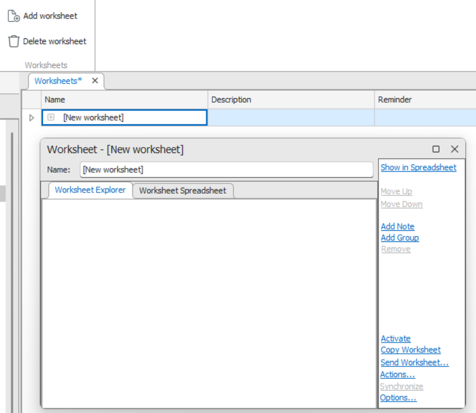

# Worksheets

The **Worksheets** feature helps organize and track records related to a specific task or unit of work. A worksheet acts as a reminder and workspace for managing multiple records and their associated actions.

---

## Overview

A worksheet is defined by:
- The records it contains and their order  
- How records are displayed (presentation style)

Each worksheet:
- Contains one or more ordered records (nodes, paths, connectors, etc.)
- May include end-user notes and reminders
- Has a name, description, and activity state
- Belongs to a single user (can be handed over to others)

> ⚙️ Worksheets have fixed, non-configurable properties.

### Viewing Worksheets
1. Start **Aktavara Console**.
2. Go to **Tools → Worksheets**.  
   → The *Worksheets Overview* window opens.
3. Selecting a worksheet shows its details in the **Properties** pane.

**Power Users** can view all users’ worksheets and delete them if needed.

If a worksheet is associated with a node, it can be accessed via the node’s **context menu** in Explorer. Associated worksheets display a column with the linked record’s description — clicking it synchronizes the Console context (Properties, Info Window, Record Searches, etc.).

You can right‑click worksheets in the overview to open, activate, copy, delete, send, or show records in Explorer.

---

## Add or Remove Worksheets

### Create a New Worksheet
1. Start **Aktavara Console** → open **Tools → Worksheets**.
2. Double‑click the empty row (*) or press **CTRL + B + N**.  
   *(Alternatively: Edit → Add Worksheet.)*
3. To create a worksheet for a node:  
   - Expand to the target node.  
   - Use **Add Worksheet** or the same keyboard shortcut.
4. Fill in properties — *Name*, *Description*, and *Reminder Date*.
5. Add records as needed.
6. Click **Save**.

### Remove a Worksheet
1. In the *Worksheets Overview*, select the worksheet.  
2. Press **DELETE** or right‑click → **Delete Worksheet**.  
3. Confirm deletion → worksheet appears with a strikethrough.

---

## Worksheet Reminders

If a worksheet has a reminder date set, expired reminders appear upon login.  
Check **Do not show again** to suppress them for the session.  
Shortcut: **CTRL + B + R** opens the worksheet from the reminder list.

---

## Working with Records

You can **add**, **remove**, **reorder**, or **view** records within worksheets.

### Add Records
- Drag and drop records into the Worksheet window.  
- For node records, use the SmartTag to choose hierarchy.  
- Shortcut: **CTRL + B + A** adds the selected record to the active worksheet.

### Remove Records
- Select an item → click **Remove** or press **DELETE**.

### Reorder Records
- Select a record → use **Move Up / Move Down** links or drag and drop.

### Show Records in Explorer or Spreadsheet
- Right‑click a worksheet or record → **Show in Explorer**.  
- Click **Show in Spreadsheet** for a tabular view.

Right‑click any record for more context‑specific actions.

---

## Worksheet Views

Worksheets can be viewed in two modes:
1. **Explorer View** – hierarchical layout of node records (can be customized).  
2. **Spreadsheet View** – text‑based, sortable and filterable grid.

Use tabs at the bottom of the window to switch views.  
View selection persists between sessions.

### Custom Hierarchies
You can define custom node hierarchies to simplify displays by skipping intermediate levels. These settings come from **Aktavara Designer** and can also be adjusted in the Worksheet window.

---

## Notes in Worksheets

Use notes to capture comments or details related to a task.

### Add a Note
1. Click **Add Note** → choose **To Root** or **To Selected Record**.

### Edit or Remove Notes
- **Edit:** Right‑click note → **Edit** → modify in text box.  
- **Remove:** Right‑click note → **Remove**.

---

## Active and Inactive Worksheets

Only one worksheet can be active at a time.

An **active worksheet**:
- Opens automatically upon login.
- May auto‑display its records in Explorer.
- Appears **bold** and at the top of the Worksheets list.

### Activate / Deactivate
- Click **Active** or **Deactivate** in the Worksheet window.  
- Or right‑click the worksheet in the overview and choose **Active**.

---

## Copy or Send Worksheets

### Copy
Click **Copy Worksheet** to duplicate the current one.  
→ A new worksheet appears in the overview list.

### Send
1. Click **Send Worksheet**.  
2. In the dialog, select **User Group** or use **Filter By** to find the recipient.  
3. Click **OK** to hand over the worksheet.

---

## Worksheet Options

Access via **Options** link in the Worksheets window.

Tabs include:
1. **Worksheet Hierarchy** – controls structure for this worksheet.  
2. **General Hierarchy** – sets default structure for all worksheets.  
3. **Options** – manages display and behavior preferences.

### Custom Hierarchical Grouping
1. Click **...** to open the *Hierarchical Grouping* dialog.  
2. Select **Child Type** and desired **Node Type** relationships.  
3. Use filters to refine the list and **Add / Remove** entries.  
4. Configure options:
   - Show last active worksheet at login.  
   - Synchronize Explorer with active worksheet.  
   - View deleted records.

---

✅ **Tip:** Use keyboard shortcuts (e.g., CTRL + B + N, CTRL + B + A) for faster worksheet management.
