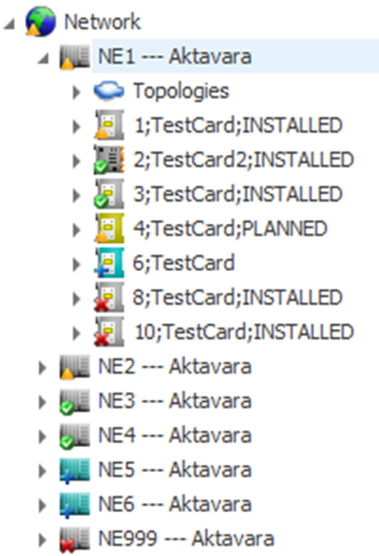
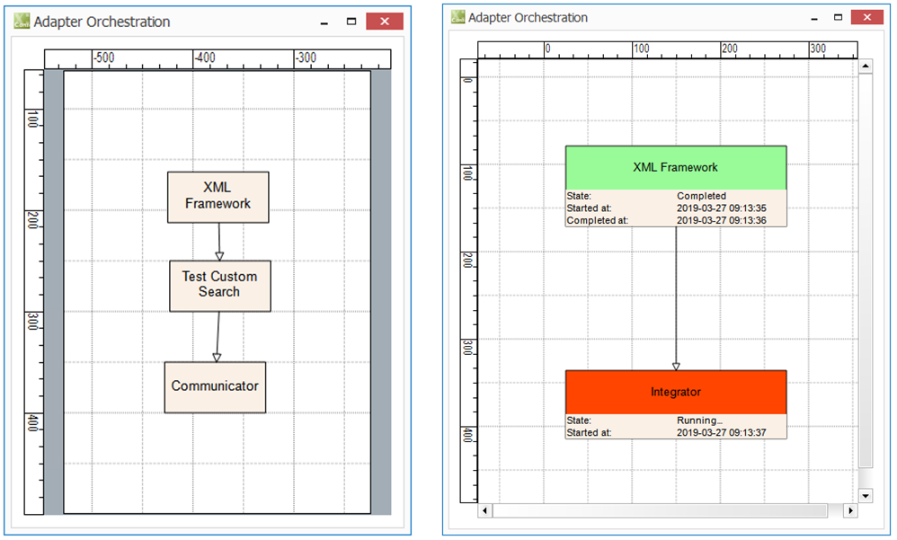
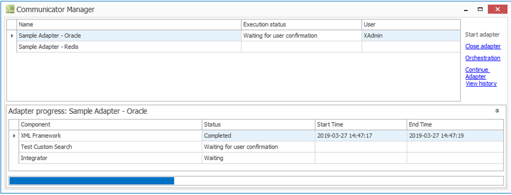

# Communicator Data in the Console

The **Communicator** feature in the Aktavara Console allows users to view, compare, and manage data exchanged through configured adapters. When active, a **Communicator toolbar** appears in the Ribbon.

---

## Overview

- **Communicator Data**: Shows information from external adapters and logs from adapter executions.  
- **Visibility Control**: Select visible adapters from the dropdown in the top‑right corner of the Console.  
- **Workspaces**: External data, adapter logs, and comparisons appear in dedicated workspaces such as *External Data Explorer*, *Reconciliation Logs*, and *Communicator Manager*.

> ⚙️ Data visible in these workspaces is considered **external data** — distinct from the main database.

---

## Data Visibility & Indicators

- Workspaces displaying external data use a **light‑grey background**.  
- Overlay icons represent reconciliation results:  
  - ✅ **OK** — identical records  
  - ⚠️ **Error** — differences found  
  - ❌ **Delete** — record only in main database  
  - ➕ **Add** — record only in Communicator database  

> Icons may vary depending on configuration.

---

## Network Explorer Integration

Communicator data appears in two ways:

1. **Overlay Icons** — show reconciliation results for visible adapters.  
   - No overlay = record not reconciled for any visible adapter.  
2. **External‑only Records** — appear under their parent node if missing from the main data (e.g., installed but unplanned cards).

> Note: Errors may also reflect issues in related child or connected records.

You can view matching external records via **Show in External Explorer** on the toolbar.

---

## External Data Explorer

The **External Data Explorer** shows hierarchical adapter data (Nodes, Connectors, Paths, Topologies) and comparison results with the main database.

### Key Features
- Displays only records from the Communicator database (no “Delete” entries).  
- Overlay icons indicate reconciliation results.  
- Selecting a record synchronizes:  
  - The **Properties** window (external attributes shown first)  
  - The **Communicator Adapter Log** workspace (filtered for that record)

### Toolbar Actions
- **Show in Network Explorer** (for OK/Error records)  
- **Refresh Data**  
- **Propagation Status** toggle:  
  - **Own Status** — icons show record’s own comparison result.  
  - **Upward Status** — errors propagate upward, marking parent records (useful for locating error branches).

> Reopen the workspace from the **Communicator Ribbon** if closed.

---

## Graphics Workspace

In graphical views, external data is represented with overlay icons and includes external‑only records.

---

## Properties Workspace

When external data exists for a record, new **adapter‑specific tabs** appear in the **Properties** window.

Each tab contains three sections:
1. **Compared Data** — attributes compared to the main record.  
2. **Source Information** — raw attributes from the Communicator database.  
3. **Comparison Information** — reconciliation summary:  
   - *Last Reconciliation Date*  
   - *Reconciliation Issues* (OK, Insert, Update, Delete)  
   - If Redis is used, propagation details (used with *Upward Status*).

> External data may differ slightly from source systems due to transformations during import.

---

## Reconciliation Logs Workspace

Displays logs generated by Communicator adapters during execution.  
Opened from context menus in the *External Data Explorer* (adapter or record level).

### Behavior
- Synchronizes automatically with the selected adapter or record.  
- Read‑only, spreadsheet‑style workspace supporting sort, filter, grouping, and column customization.

### Default Columns
| Column | Description |
|--------|--------------|
| **Category** | Log entry category |
| **Date/Time** | Timestamp of log |
| **Severity** | Info, Warning, Error, Critical |
| **Description** | Log message |
| **Details** | Full summary of the event |

Logs can be exported via **Export Logs** in the Communicator toolbar (supports text export with custom qualifier/separator).

---

## Communicator Manager

Accessed from the **Communicator toolbar**, this workspace allows manual adapter execution and progress tracking.

### Overview List
Displays all visible adapters with:
- **Adapter Name**  
- **Execution Status** (Waiting, Running, Completed)  
- **Started By** user

### Available Actions
- **Start Adapter** — run selected adapter.  

- **Close Adapter** — stop execution (after active component completes).  

- **Orchestration** — shows adapter workflow diagram and per‑component execution details.  

  

- **View History** — lists previous executions with status, user, start/end times, and task IDs.  

- **Continue Adapter** — appears dynamically if a component requires user confirmation.

### Execution Details Panel
The lower pane displays real‑time component progress with status (Waiting, In Progress, Completed, Failed) and start/end timestamps.

---

✅ **Tips**
- Use **Upward Status** to quickly identify network segments with reconciliation issues.  
- Export reconciliation logs for troubleshooting.  
- Launch adapters manually from **Communicator Manager** for immediate data refresh.
