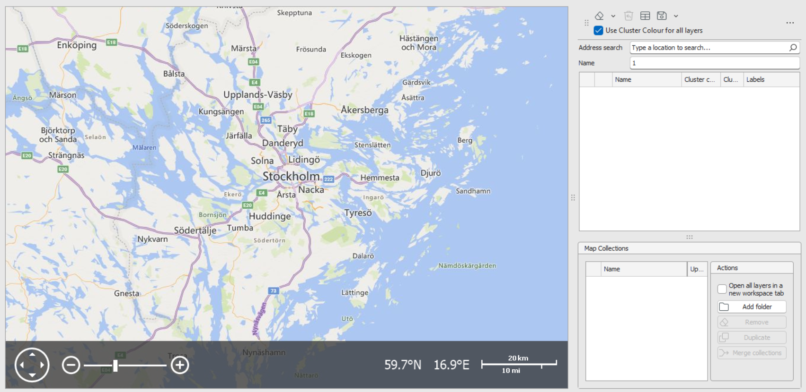
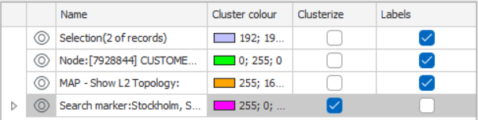
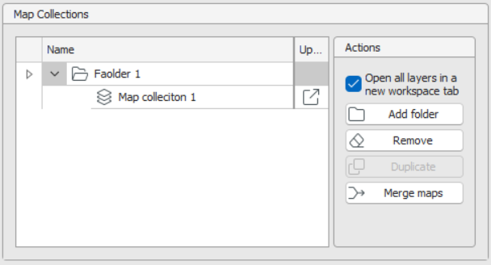

# Map Workspace

The **Map Workspace** lets you visualize and work with network records on an interactive map. It supports drag‑and‑drop loading, layer controls, clustering, labeling, geocoded address lookup, and saved **Map Collections** for repeatable views.

---

## Access & Data Loading

### Open the Map
- **View → Map** on the Ribbon opens an empty Map Workspace tab.

### Load Data onto the Map
- **Drag & drop** records (e.g., *Sites* with coordinates) from **Network Explorer** or a **Spreadsheet** onto the map.  
- **Context menu:** Right‑click a record → **Open in Map Workspace**.  
- **Saved searches:** Configure a search with **Map** as the output. Running it creates a **new layer** containing the search results.

> Each drop/search creates a **separate layer**. Selecting multiple records and dropping them together groups them into one layer.

Click map objects to select them; details appear in the **Properties** pane.

---

## Layer Control (right panel)

Each layer has inline controls:

- **Visibility**: Toggle the *eye* icon to show/hide a layer. Re‑enabling auto‑zooms to that layer.
- **Name**: Click to rename the layer.
- **Cluster Color**: Color applied **when clustering** is enabled for that layer.  
  *(Default feature colors are defined in **Designer**; cluster color is applied dynamically to clusters.)*
- **Cluster**: Checkbox to turn clustering **on/off** for the layer.
- **Labels**: Checkbox to show/hide labels for all objects in the layer.  
  *(Label definitions come from **Designer** and can't be changed here.)*

> Notes: Node icons typically cannot be re‑coloured; cluster color is most useful for **paths** (lines). If clustering is off, rendering falls back to Designer‑defined colors.

---

## Map Toolbar

- **Clear Layers**: Dropdown to **Clear Selected** (multi‑select with **CTRL**) or **Clear All**.  
  An **Undo** button restores recently cleared layers.
- **Show in Spreadsheet**: Opens the selected layers in a Spreadsheet tab.
- **Use Cluster Color for All Layers**: Global checkbox that applies the layer's cluster color to rendered objects across layers.  
  If unchecked, the map uses Designer defaults for rendering (especially visible for paths).

- **Address Search**: Enter an address and click **Search** to geocode it to coordinates.
  Results are added as **Search Marker** layers; multiple addresses create separate marker layers.  
  *(Geocoder is regionalized to your deployment, e.g., Sweden.)*

---

## Map Collections

Save the current set of layers for later reuse.

### Create & Manage
1. Click **Save → Save as New** to create a **Map Collection** (shown under **Map Collections** beneath the Layer Control).  
2. Rename the collection inline.
3. **Folders**: Use **Add Folder** then drag & drop collections to organize in a tree.
4. **Actions**: **Delete**, **Duplicate** (make a copy to tweak while keeping the original), **Merge Maps**:
   - Choose a **destination** collection and a **source** collection to merge.  
   - After merging, the source collection is absorbed into the destination.
5. **Open in New Workspace Tab**: Checkbox to load a collection into a **new Map** tab instead of the current one. Multiple Map workspaces can be open simultaneously.

---

### Open a Map Collection

1. Click on the 'Open in' icon of **Map Collection** you want to open 
2. Depending on the selection of **Open in New Workspace Tab**, the map collection layers will unload into the existing map workspace or a new workspace tab will open. 

---

✅ **Tips**

- Drop records in meaningful groups to create tidy, purpose‑built layers.
- Use **Cluster** + **Cluster Color** for dense areas; rely on Designer colors when clustering is off.
- Keep **Report/Search outputs** reproducible by saving them as **Map Collections**.
